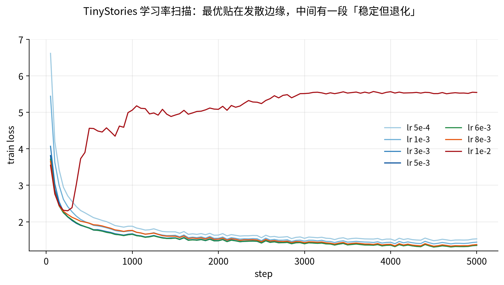
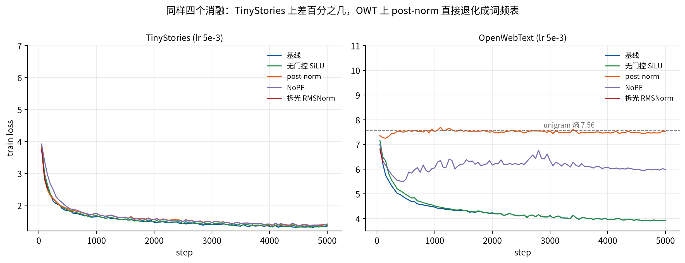
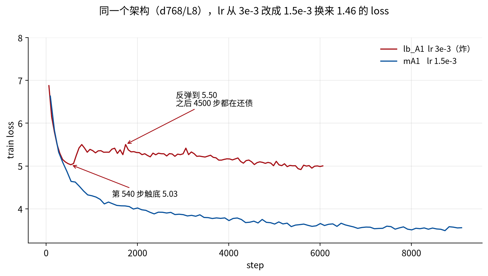
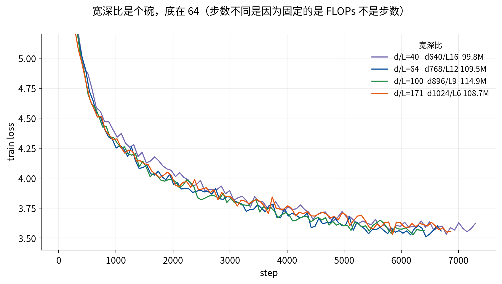
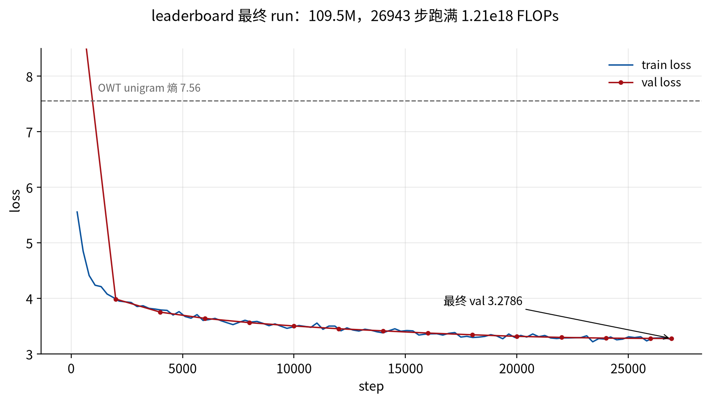

# CS336 Assignment 1 · 实验笔记

概念推导在 [`notes.md`](notes.md)，这份文件只记**实验**：每一步做了什么、怎么做的、数据是什么、曲线上比出来什么。

按**时间顺序**排，不按主题分类——每一步都是被上一步的结果逼出来的，顺序本身就是论证。每节固定五段：

> **① 什么逼出这一步** → **② 怎么做的**（配置 / 命令 / 预算） → **③ 数据** → **④ 曲线上看到什么** → **⑤ 因此下一步**

**硬件**：单张 RTX 5090（32 GB，bf16 稠密峰值 209.5 TFLOPS）。一次 TinyStories 完整训练（5000 步 × 有效 batch 256 × 上下文 256 = 3.28 亿 token）约 9.5 分钟。

**两个基线**：

| | TinyStories | OpenWebText |
| --- | --- | --- |
| $V$ / $T$ | 10000 / 256 | 32000 / 256 |
| $d$ / $L$ / $h$ / $d_{ff}$ | 512 / 4 / 16 / 1344 | 同左 |
| 参数量 | 22.70 M | 45.22 M |
| 每 token $3F/T$ | 111.7 MFLOPs | 179.3 MFLOPs |
| 最好成绩 | **1.3323** | 3.9287 → 最终 **3.2786** |

所有 run 在 wandb project **`cs336-hw1`**，run 名与下文「run」列一一对应。

---

# 1. 总表

两张表。**表 A 是作业实验**（预算固定：5000 步 × 3.28 亿 token），**表 B 是 leaderboard 探索**（预算本身是变量，单列一栏）。

$\Delta$ 一律对**同语料同预算的基线**取；$\Delta/\sigma$ 用**该语料自己的** $\sigma$。

## 表 A：作业实验

| # | 维度 | 设置 | lr | 有效 batch | 参数量 | **val loss** | $\Delta$ | $\Delta/\sigma$ | 峰值显存 | MFU | run |
|:--|:--|:--|:--|:--|:--|:--|:--|:--|:--|:--|:--|
| | **── 噪声底线（读下面任何一行之前先看这里）──** ||||||||||
| 1 | 种子 | seed 1337 | 5e-3 | 256 | 22.70 M | 1.3381 | — | — | ~18 GB | 30.8% | `t8nhfslq` |
| 2 | 种子 | seed 2 | 5e-3 | 256 | 22.70 M | 1.3428 | — | — | | | `seed2` |
| 3 | 种子 | seed 3 | 5e-3 | 256 | 22.70 M | **1.3323** ← 全场最好 | — | — | | | `seed3` |
| | | | | | | **$\sigma=0.0053$，极差 0.0105** ||||||
| | **── 学习率（batch 256 固定）──** ||||||||||
| 4 | lr | 5e-4 | 5e-4 | 256 | 22.70 M | 1.5066 | +0.169 | 31.9 | | | `m7lo15v4` |
| 5 | lr | 1e-3 | 1e-3 | 256 | 22.70 M | 1.4186 | +0.081 | 15.3 | | | `x9z3zo8x` |
| 6 | lr | 3e-3 | 3e-3 | 256 | 22.70 M | 1.3512 | +0.014 | 2.5 | | | `dn21ib3d` |
| 7 | lr | **5e-3**（基线） | 5e-3 | 256 | 22.70 M | **1.3377** | 0 | — | | | 上面三条 |
| 8 | lr | 6e-3 | 6e-3 | 256 | 22.70 M | 1.3328 | −0.005 | **0.9** ← 噪声 | | | `lr6e-3` |
| 9 | lr | 8e-3 | 8e-3 | 256 | 22.70 M | 1.3539 | +0.016 | 3.1 | | | `lr8e-3` |
| 10 | lr | 1e-2 | 1e-2 | 256 | 22.70 M | **5.5256** ← 发散 | +4.19 | — | | | `32lczj9f` |
| | **── Batch（lr 1e-3 固定，注意不是最优 lr）──** ||||||||||
| 11 | batch | 1 | 1e-3 | 1 | 22.70 M | 2.9307 | — | — | | | `jmqgpumc` |
| 12 | batch | 64 | 1e-3 | 64 | 22.70 M | 1.5452 | — | — | | | `8q3choii` |
| 13 | batch | 128 | 1e-3 | 128 | 22.70 M | 1.4694 | — | — | | | `nmol1cdt` |
| 14 | batch | 256 | 1e-3 | 256 | 22.70 M | 1.4188 | — | — | ~18 GB | 30.8% | `t9jnpkxj` |
| 15 | batch | **352**（显存墙） | 1e-3 | 352 | 22.70 M | **1.4025** | — | — | **24.73 GB** | **32.98%** | `bs352` |
| 16 | batch | 384 / 512 / 1024 | | | | **OOM** | — | — | >32 GB | — | — |
| | **── 架构消融 × TinyStories（lr 5e-3 / batch 256）──** ||||||||||
| 17 | 架构 | 无门控 SiLU，$d_{ff}$=2048 | 5e-3 | 256 | 22.83 M | 1.3404 | +0.003 | **0.5** ← 噪声 | | | `abl_silu` |
| 18 | 架构 | post-norm | 5e-3 | 256 | 22.70 M | 1.3762 | +0.039 | 7.3 | | | `abl_postnorm` |
| 19 | 架构 | NoPE | 5e-3 | 256 | 22.70 M | 1.3945 | +0.057 | 10.7 | | | `abl_nope` |
| 20 | 架构 | 拆光 RMSNorm | 5e-3 | 256 | 22.69 M | **NaN**（第 200 步） | — | — | 17.00 GB | 33.7% | `abl_nonorm_lr5e-3` |
| 21 | ↳ | 同上，lr 1e-3 | 1e-3 | 256 | 22.69 M | **NaN** | — | — | | | `abl_nonorm_lr1e-3` |
| 22 | ↳ | 同上，lr **7e-4**（其自身最优） | 7e-4 | 256 | 22.69 M | **1.4885** | +0.151 | 28.5 | | | `abl_nonorm_lr7e-4` |
| 23 | ↳ | 同上，lr 5e-4 | 5e-4 | 256 | 22.69 M | 1.5433 | +0.206 | 38.8 | | | `abl_nonorm_lr5e-4` |
| | **── 语料（架构、步数、有效 batch 全部对齐）──** ||||||||||
| 24 | 语料 | OWT，lr 3e-3 | 3e-3 | 128×2 | 45.22 M | 3.9489 | — | — | | | `owt_lr3e-3` |
| 25 | 语料 | **OWT，lr 5e-3**（OWT 基线） | 5e-3 | 128×2 | 45.22 M | **3.9287** | 0 | — | 19.05 GB | 26.2% | `owt_lr5e-3` |
| 26 | 种子 | OWT seed 2 | 5e-3 | 128×2 | 45.22 M | 3.9339 | — | — | | | `owt_seed2` |
| | | | | | | **OWT $\sigma\approx0.0037$（2 种子，自由度 1，只当量级用）** ||||||
| | **── 架构消融 × OWT（检验结论能否迁移）──** ||||||||||
| 27 | 架构 | OWT + 无门控 SiLU | 5e-3 | 128×2 | 45.35 M | 3.9269 | −0.002 | **0.5** ← 噪声 | | | `owt_abl_silu` |
| 28 | 架构 | OWT + post-norm | 5e-3 | 128×2 | 45.22 M | **7.4726** ← 没学起来 | **+3.544** | ~950 | | | `owt_abl_postnorm` |
| 29 | 架构 | OWT + NoPE | 5e-3 | 128×2 | 45.22 M | **5.9762** | **+2.048** | ~550 | | | `owt_abl_nope` |
| 30 | 架构 | OWT + 拆光 RMSNorm | 5e-3 | 128×2 | 45.21 M | **NaN** | — | — | | | `owt_abl_nonorm` |

## 表 B：leaderboard 探索（全部 OWT + weight tying）

$C = 1.21\times10^{18}$ FLOPs = 45 分钟 B200 的等效换算（§10）。所有 run 的**有效 batch 都是 256**，步数由预算反解。

| # | 阶段 | 配置 | $d/L$ | 参数量 | lr | 预算 | 步数 | **loss** | run |
|:--|:--|:--|:--|:--|:--|:--|:--|:--|:--|
| | **── 第一版网格：全体共用 lr=3e-3（作废）──** |||||||||
| 31 | 网格 v1 | $d$768 $L$8 | 96 | 81.2 M | 3e-3 | $C/6$ | 6078 | **4.9853** ← 炸了 | `lb_A1` |
| | **── lr 探针（固定 $d$768/$L$8，1500 步完整 cosine，末 10 点均值）──** |||||||||
| 32 | lr 探针 | | 96 | 81.2 M | 1e-3 | 4.97e16 | 1500 | 4.2028 | `lr_probe_1e-3` |
| 33 | lr 探针 | | 96 | 81.2 M | **1.5e-3** | 4.97e16 | 1500 | **4.1615** | `lr_probe_1.5e-3` |
| 34 | lr 探针 | | 96 | 81.2 M | 2e-3 | 4.97e16 | 1500 | 4.2395 | `lr_probe_2e-3` |
| 35 | lr 探针 | | 96 | 81.2 M | 3e-3 | 4.97e16 | 1500 | 5.0228 | `lr_probe_3e-3` |
| | **── 形状 × lr 探针（12 条，固定 5.04e16 FLOPs，中心值按 $1/d$ 缩放）──** |||||||||
| 36–38 | 探针 | $d$896 $L$9 | 100 | 114.9 M | 0.86 / **1.29** / 1.93 e-3 | 5.04e16 | 1077 | 4.3813 / **4.3308** / 4.5140 | `pA2_*` |
| 39–41 | 探针 | $d$1024 $L$10 | 102 | 159.3 M | 0.75 / **1.13** / 1.69 e-3 | 5.04e16 | 779 | 4.5931 / **4.5081** / 4.6383 | `pA3_*` |
| 42–44 | 探针 | $d$768 $L$12 | 64 | 109.5 M | 1.00 / **1.50** / 2.25 e-3 | 5.04e16 | 1122 | 4.3479 / **4.3326** / 4.5044 | `pB1_*` |
| 45–47 | 探针 | $d$1024 $L$6 | 171 | 108.7 M | 0.75 / **1.13** / 1.69 e-3 | 5.04e16 | 1146 | 4.3534 / **4.2818** / 4.3895 | `pB2_*` |
| | **── 中间预算 $C/4$（各用自己的最优 lr）──** |||||||||
| 48 | $C/4$ | $d$768 $L$8 | 96 | 81.2 M | 1.50e-3 | 3.02e17 | 9117 | **3.5300** | `mA1` |
| 49 | $C/4$ | $d$768 $L$12 | **64** | 109.5 M | 1.50e-3 | 3.02e17 | 6732 | **3.5533** ← 同规模最好 | `mB1` |
| 50 | $C/4$ | $d$896 $L$9 | 100 | 114.9 M | 1.29e-3 | 3.02e17 | 6463 | 3.5666 | `mA2` |
| 51 | $C/4$ | $d$640 $L$16 | 40 | 99.8 M | 1.80e-3 | 3.02e17 | 7323 | 3.5684 | `mC1` |
| 52 | $C/4$ | $d$1024 $L$6 | 171 | 108.7 M | 1.13e-3 | 3.02e17 | 6878 | 3.5864 | `mB2` |
| 53 | $C/4$ | $d$1024 $L$10 | 102 | 159.3 M | 1.13e-3 | 3.02e17 | 4675 | 3.6465 | `mA3` |
| | **── 最终提交 ──** |||||||||
| 54 | **跑满 $C$** | **$d$768 $L$12** | **64** | **109.5 M** | **1.50e-3** | **1.21e18** | **26943** | **3.2786** | `final_d768L12` |

## 怎么读这两张表

**横着比维度，不要竖着比行。** 每个维度各自能拿到的最大改善：

| 维度 | 从最差到最好 | 值多少 | 相当于多少个 $\sigma$ |
| --- | --- | --- | --- |
| **学习率** | 5e-4 → 5e-3 | **0.169** | 32 |
| **Batch** | 64 → 352 | **0.143** | 27 |
| **架构（TinyStories 上）** | 四个消融加起来 | **≤ 0.10** | ≤ 19 |
| **种子**（不可控） | — | 0.011 | 2 |

**调超参比改架构值钱得多。** 单是把 lr 从 5e-4 调到 5e-3 就抵得过四个架构消融加起来还有富余，而 lr 是免费的——不需要改一行模型代码。

**表 B 第 31 行和第 48 行是同一个架构**：`lb_A1` 用 lr=3e-3 得 4.9853，`mA1` 用 lr=1.5e-3 得 3.5300，预算只差 1.5 倍——**光是把 lr 改对就值 1.46**，比表 A 里所有架构效应加起来还大一个数量级。

**表 A 第 20–23 行是信息量最大的一组**：它把"改架构"和"改超参"的耦合暴露出来了（见 §7.1）。

**第 16 行（OOM）也是数据**。handout 要"扫到显存上限"，那个上限本身就是 deliverable。

---

# 2. 起点：MFU 口径错了

**① 什么逼出这一步。** 一句提问：「我现在 bf16 的 MFU 才 22% 这对么」。当时 `train.py` 报的是 22–23%。

**② 怎么做的。** 没跑任何 run，只是把公式明码写出来再代入数值：

```
MFU = tok/s × (每 token FLOPs) ÷ 峰值
```

两个因子分别核。

**③ 数据。** 两个都错，而且方向相反：

| | 原来 | 正确 | 差 |
| --- | --- | --- | --- |
| 每 token FLOPs | $6P$ = 136.18 M | $3F/T$ = 111.72 M | $6P$ **高估 21.9%** |
| 峰值 | 340 TFLOPS | 209.5 TFLOPS | **高估 62%** |

$6P$ 高估的两个来源：① 它把 embedding 查表当算力，而查表是索引、**0 FLOP**——本配置下 embedding 占 $P$ 的 22.6%，凭空多 30.72 MFLOPs/token；② 它漏掉注意力的两个 $T^2$ 项，少算 6.29 MFLOPs/token。

峰值那个 340 不对应 RTX 5090 任何公布口径：419 是带 sparsity 的，104.8 是 FP32 shader，**PyTorch 的 bf16 矩阵乘走 FP32 累加那条，209.5**。

**④ 验证。** 卡当时被占着，没法直接测峰值。但**比值仍然是准的**——实测 bf16 : tf32 = 109.2 : 54.7 = **2.00**，正好对上规格表的 209.5 : 104.8。

**⑤ 结论。** 两个错方向相反、互相掩盖了一部分，报出来的 23% 看着"像那么回事"。真实值是 **30.8%**（实际 64.6 TFLOPS）。对 22.7 M 的小模型 + 手写 attention，30% 算健康（nanoGPT 124M 在 A100 上约 37%，PaLM 540B 46%）。

> **这个偏差随配置剧烈变化**：OWT（$V$=32K）上 embedding 占参数 72%，$6P$ **高估 51.3%**；而开了 weight tying 之后 $6P$ 反过来**低估 4.1%**（embedding 只算一份参数，但 `lm_head` 的矩阵乘照跑）。$6P$ 不是"差不多能用的近似"，误差大小和**方向**都取决于 $V\cdot d$ 相对 $L\cdot d^2$ 的比例。

---

# 3. 第一件该做却最后才做的事：量噪声

**① 什么逼出这一步。** 跑完 lr sweep 和四个消融之后，手里一堆差值：SwiGLU vs SiLU 差 0.0023，6e-3 vs 5e-3 差 0.0049，post-norm 差 0.038。**问题是 0.0023 算不算"更好"？** 没有参照系就没法回答。

**② 怎么做的。** 三条**完全同配置、只换随机种子**的基线（lr 5e-3 / batch 256 / 5000 步）：

```bash
train.py --config tinystories_17M_tuned.yaml --learning_rate 5e-3 --seed {1337,2,3}
```

**③ 数据。**

$$\text{val loss} = 1.3381 \;/\; 1.3428 \;/\; 1.3323 \quad\Rightarrow\quad \sigma \approx 0.0053,\ \text{极差}\ 0.0105$$

**④ 有了 $\sigma$ 再回头看，两处结论直接作废：**

| 我原先说的 | $\Delta$ | 倍数 | 实际 |
| --- | --- | --- | --- |
| "最优 lr 是 6e-3" | 0.0049 | $0.9\sigma$ | **站不住**。5e-3 和 6e-3 分不出高下，最优是一段**平台** |
| "SwiGLU 比 SiLU 好 0.0023" | 0.0023 | $0.5\sigma$ | **站不住**。SiLU 的 1.3404 夹在基线自己两个种子（1.3381、1.3428）**中间** |

活下来的：NoPE $10.7\sigma$、post-norm $7.3\sigma$、8e-3 退化 $3.1\sigma$、3e-3 $2.5\sigma$（勉强）。

**⑤ 结论。** **任何"A 比 B 好"的结论，都必须先知道"A 比 A 自己好多少"。** 代价是两条 20 分钟的重复实验，换来的是后面每个数字能不能写进报告。这一步应该排在**第一条**实验，而不是补跑。

---

# 4. 学习率：最优贴在发散边缘，中间还有一段窄带

**① 什么逼出这一步。** handout `learning_rate` 要三样：多 lr 曲线 + 搜索策略、val loss ≤ 1.45 的模型、至少一条发散曲线 + edge-of-stability 分析。

**② 怎么做的。** 先按半个数量级粗扫（5e-4 → 1e-2）定出"最优在哪档、发散在哪档"，再在两者之间补点。粗扫给出最优 5e-3、发散 1e-2，只差一档，于是补 6e-3 和 8e-3。全部固定 batch 256 / 5000 步。

**③ 数据。**

| lr | 5e-4 | 1e-3 | 3e-3 | **5e-3** | **6e-3** | 8e-3 | 1e-2 |
| --- | --- | --- | --- | --- | --- | --- | --- |
| val loss | 1.5066 | 1.4186 | 1.3512 | **1.3377**(3 种子) | **1.3328** | 1.3539 | 5.5256 |

**④ 曲线上看到什么。**



- **1e-2（红）在第 300 步左右起飞**，之后一路爬到 5.5 并平在那里——不是慢慢变差，是**一次性失稳后再也回不来**
- 5e-4（最浅的蓝）全程贴在其他曲线上方，纯粹是"走得太慢"
- 中间那几条几乎重叠，肉眼分不出——这正是为什么 §3 的 $\sigma$ 是必需的

**⑤ 结论。**

**deliverable ②（≤ 1.45）**：达标，最好 **1.3323**，比要求低 0.12。

**deliverable ③（edge of stability）**：最优平台 5e-3~6e-3、发散阈值 1e-2，只差 **1.7~2 倍**——"最好的学习率贴在发散边缘"成立。

补的两点还捞到一个粗扫看不见的结构：**8e-3 已经变差（$3.1\sigma$），但还没发散**。

```
   ← 稳定且改善 →|← 平台 →|← 稳定但退化 →|← 发散 →
 5e-4 ········ 5e-3 ·· 6e-3 ······· 8e-3 ······· 1e-2
1.5066        1.3377  1.3328       1.3539       5.5256
```

从"最优"到"炸掉"**不是断崖**，中间有一段仍然收敛、只是性能退化的窄带。这和 edge-of-stability 的图像自洽：损失面的最大 Hessian 特征值会自己调整到 $\approx 2/\text{lr}$ 附近，lr 越大越把优化推向更平的区域，直到维持不住。

**记住这个数：整个 sweep 的收益 $1.5066\to1.3323 = 0.174$，全部来自把 lr 从 5e-4 推到 6e-3。** §7.1 会再用一次。

---

# 5. Batch 与显存墙：先分清"崩了"和"装不下"

**① 什么逼出这一步。** handout 要求"从 1 扫到显存上限"。扫到 1024 时报错：

```
RuntimeError: invalid shape dimension -1673527296 at index 0 of shape [-1673527296]
```

**② 怎么做的（先定性再定量）。** logits 是 $[1024,256,10000]$ = 2,621,440,000 个元素，而

$$2{,}621{,}440{,}000 - 2^{32} = -1{,}673{,}527{,}296$$

一位不差。根因在 `cross_entropy` 里那句 `einx.get_at`：**它先把张量摊平成一维、再用线性下标取，而摊平长度用 int32 存**。换成 `torch.gather`（按维度取，不摊平）解决。

验证方式：fp64 下与 `F.cross_entropy` 对齐（atol 1e-10）、$\pm10^4$ 的极端 logit 不出 inf/nan、**直接跑那个 26.2 亿元素的形状**。

**修完 batch=1024 依然跑不了，但这次是真 OOM。** 这两件事必须分开记——一个是"代码有 bug"，另一个是"这张卡就这么大"。

然后加 `torch.cuda.max_memory_allocated()` 到日志和 wandb，逐档探墙。

**③ 数据。**

| batch | 320 | **352** | 384 | 512 | 1024 |
| --- | --- | --- | --- | --- | --- |
| 峰值显存 | 22.51 GB | **24.72 GB** | OOM | OOM | OOM |

| batch | 1 | 64 | 128 | 256 | **352** |
| --- | --- | --- | --- | --- | --- |
| val loss | 2.9307 | 1.5452 | 1.4694 | 1.4188 | **1.4025** |
| MFU | | | | 30.8% | **32.98%** |

**④ 两个反直觉的点。**

**384 按线性外推只要 26.9 GB、卡上有 32 GB，却仍然 OOM。** 差的是 `max_memory_allocated`（PyTorch 实际分配的）和 `nvidia-smi` 看到的之间那一截：分配器保留但未使用的块、碎片、CUDA context、显示占用。**"理论显存够"和"跑得起来"之间永远有 20–25% 的缓冲。**

**收益递减很快**：每翻一倍换来的改善是 0.076 → 0.051 → 0.016（最后一档只翻 1.375 倍）。

**⑤ 结论与三个口径限制。**

**"大 batch 有害"在这里看不到**，因为实验是**固定步数**的：batch 越大看到的 token 越多，两个效应同向。常说的"批量太大泛化更差"前提是固定 epoch 数。要复现那个现象得改成固定 token 预算再扫。

**batch=1 掉到 2.93 有三重原因叠加**，不能只归给 batch：① 只看了 $1/352$ 的 token；② lr 没跟着重调（沿用 1e-3，对 batch=1 几乎必然过大）；③ 单样本的梯度噪声。

**真正让人想要大 batch 的是吞吐**：256 → 352 让 MFU 从 30.8% 涨到 32.98%，因为矩阵乘的 $M$ 维从 65,536 涨到 90,112。**是硬件效率，不是收敛质量。**

---

# 6. 四个消融（TinyStories）

**① 什么逼出这一步。** handout §7.3 的四道题。`train.py` 当时 30 个 flag，**一个消融开关都没有**。

**② 怎么做的。** 加三个开关，不传任何一个 = 原来的行为：

```
--norm pre|post|none    pre=基线；post=式 27/28（同时去掉 ln_final）；none=全拆
--ffn swiglu|silu       silu=无门控对照组，自动把 d_ff 改成 4·d_model 对齐参数量
--no_rope               NoPE
```

三个实现上的决定：

- **`ln_final` 只有 pre-norm 保留。** post-norm 每个子层出口本就归一化过；`norm=none` 是要故意全拆。这是 handout "remove all of the RMSNorms from your Transformer" 的字面读法
- **`norm=none` 用 `nn.Identity` 占位**而不是不建属性，state_dict 的 key 结构不变
- **`ffn=silu` 时 $d_{ff}=4d_{\text{model}}$**：SwiGLU 三矩阵 $3\cdot512\cdot1344=2{,}064{,}384$ vs SiLU 两矩阵 $2\cdot512\cdot2048=2{,}097{,}152$，差 1.6%。用的是恒等式 $3\cdot\frac83 = 2\cdot4 = 8$。**消融的是门控，不是参数量**

开关的验证不是跑训练，是**同一份权重下换开关看输出最大差**：pre vs post 0.84 | pre vs none **126.06** | RoPE vs NoPE 0.53。`none` 那个 126 还没训练就出来了，正是残差流尺度失控。

**③ 数据**（全部 lr 5e-3 / batch 256 / 5000 步，基线 1.3377）。

| 消融 | 参数量 | val loss | $\Delta$ | $\Delta/\sigma$ |
| --- | --- | --- | --- | --- |
| 无门控 SiLU | 22.83 M | 1.3404 | +0.003 | **0.5** ← 噪声 |
| post-norm | 22.70 M | 1.3762 | +0.039 | 7.3 |
| NoPE | 22.70 M | 1.3945 | +0.057 | 10.7 |
| 拆光 RMSNorm | 22.69 M | **NaN** | — | — |

**④ 曲线上看到什么**（左半张图；右半张是下一节的 OWT）。



**左图五条几乎重叠。** 这就是全部信息——在 TinyStories 上，四个架构消融里三个肉眼分不出，第四个（拆光 RMSNorm）因为 NaN 直接从图上消失。

**⑤ 逐条结论。**

**`layer_norm_ablation`：RMSNorm 买的不是拟合，是学习率的天花板。** 在原最优 lr 下**第 200 步 NaN**，死得极有指向性：

```
step 150 | loss 2.5222 | lr 3.7500e-03   ← 一路正常下降
step 200 | loss nan    | lr 5.0000e-03   ← 炸
```

warmup 正是 200 步——**它恰好在 lr 第一次爬到峰值的那一步炸掉**。所以不是"去掉 norm 就不能训"，是"能承受的 lr 上限被大幅压低"。给它单独扫 lr：

| lr | 5e-4 | **7e-4** | 1e-3 | 5e-3 |
| --- | --- | --- | --- | --- |
| 拆光 RMSNorm | 1.5433 | **1.4885** 最优 | **NaN** | **NaN** |
| 基线 | 1.5066 | — | 1.4186 | 1.3377 |

两条曲线各自的发散阈值：基线在 $[8\text{e-}3, 1\text{e-}2)$，no-norm 在 $[7\text{e-}4, 1\text{e-}3)$。**比值约 10 倍。** 详见 §7.1 的分解。

**`pre_norm_ablation`：位置只值 0.039，但方向明确。** post-norm 1.3762（$7.3\sigma$，真信号），**但完全没有不稳定**。和上一条合起来：

> norm 的**存在**决定能不能训；norm 的**位置**决定训得多好。

**`no_pos_emb`：NoPE 能训，但让模型自己挖位置要付钱。** 1.3945（$10.7\sigma$），训练过程毫无异常。印证 Tsai 2019 / Kazemnejad 2023：decoder-only 靠因果 mask 本身就能推断位置。但 0.057 说明**从 mask 里自己挖比直接喂要贵**。

> **一个静默陷阱**：去掉 RoPE **不改变任何权重形状**。NoPE 的 checkpoint 能原样装进带 RoPE 的模型，不报错，只生成乱码。`norm`/`ffn` 至少还会 shape 不匹配。所以 `decoder.py` 必须从 config 读 `no_rope` 重建架构。

**`swiglu_ablation`：门控的效应小到测不出来。**

```
基线 seed3    1.3323
基线 seed1337 1.3381
SiLU 无门控   1.3404   ← 夹在基线自己的种子波动里
基线 seed2    1.3428
```

$0.5\sigma$。**这不是"门控带来微小改善"，是"测不出来"。** 参数量已对齐到 1.6% 以内，所以差异不来自容量。

---

# 7. 转折：消融迁到 OWT，一个迁移了、一个彻底没有

**① 什么逼出这一步。** 一句质疑：「所有的 ablation 为什么用 TinyStories，不应该用 OWT 做么」。

handout 确实把 §7.3 排在 §7.4（OpenWebText）**之前**，还有一个框明确说低资源学生"continue testing modifications on TinyStories"。**但按题面走不等于方法上站得住**，有两条实证理由怀疑这个测试台：

1. `swiglu_ablation` 只有 $0.5\sigma$——**这本身就是"分辨率不够"的读数**。TinyStories 困惑度只有 3.79，模型几乎吃透了，饱和的任务分不出组件差别
2. 笔记里 document masking 那条教训是同一个模式："在 TinyStories 上调出来的收益，到 OWT 上大概只兑现四分之一"。而 `leaderboard`（6 分）是在 OWT 上比的

**② 怎么做的。** 四个消融在 OWT 上重跑，全部对齐 lr=5e-3 / 有效 batch 256 / 5000 步。**并且先补一条 `owt_seed2` 量 OWT 自己的 $\sigma$**——TinyStories 的 $\sigma$ 是在 loss≈1.34 上量的，OWT 的 loss≈3.93，不能共用。

**③ 数据。**

$\sigma$ 先看：OWT 基线两种子 3.9287 / 3.9339，$\sigma\approx0.0037$。

| 语料 | loss 量级 | $\sigma$ | $\sigma$ / loss |
| --- | --- | --- | --- |
| TinyStories | ~1.34 | 0.0053 | 0.40% |
| OWT | ~3.93 | ~0.0037 | 0.09% |

**绝对噪声不随 loss 大小走**——事前无法预知，所以单独测这一步是必要的。

| 消融 | TinyStories $\Delta$ | 相对 TS $\sigma$ | OWT $\Delta$ | 相对 OWT $\sigma$ | 放大 | 迁移？ |
| --- | --- | --- | --- | --- | --- | --- |
| 无门控 SiLU | +0.0027 | 0.5 | **−0.0018** | 0.5 | — | ✅ 都是"测不出来" |
| post-norm | +0.0385 | 7.3 | **+3.544** | ~950 | **92×** | ❌ |
| NoPE | +0.0568 | 10.7 | **+2.048** | ~550 | **36×** | ❌ |
| 拆光 RMSNorm | NaN | — | **NaN** | — | — | ✅ 都训不了 |

**④ 曲线上看到什么**（上一节那张图的**右半张**）。

**这是整个项目最有信息量的一张图。** 右图里：

- **post-norm（橙）整条压在 unigram 熵的虚线上**——从头到尾平在 7.5，前 1250 步甚至在往上走
- **NoPE（紫）掉到 6.0 附近就停住**，起伏很大
- 基线（蓝）和无门控 SiLU（绿）**完全重叠**，一路降到 3.93
- 拆光 RMSNorm（红）因为 NaN 从图上消失

对比左图五条挤成一团，右图把同样四个改动的差别拉开了**两个数量级**。

**⑤ 结论。**

**post-norm 学到了什么？** 统计 OWT 验证集的 token 频率：$H_{\text{unigram}} = 7.5597$ nats。

```
随机猜        10.3735
unigram        7.5597   ← post-norm 停在 7.4726，只好 0.087
基线           3.9287   ← 从上下文里榨出 3.631 nats
```

**post-norm 只拿到可获取信息的 $0.087/3.631 = 2.4\%$。** 它学会了词频，然后什么都没学到。

用这个口径把四条统一起来：

| | val loss | 从上下文榨出 | 占基线 |
| --- | --- | --- | --- |
| 基线 | 3.9287 | 3.631 nats | 100% |
| 无门控 SiLU | 3.9269 | 3.633 | 100.1% ← 无差别 |
| NoPE | 5.9762 | 1.583 | **43.6%** ← 丢掉一半多 |
| post-norm | 7.4726 | 0.087 | **2.4%** ← 几乎全丢 |

门控**不影响**上下文利用，位置编码**削掉一半**，post-norm **直接摧毁**。

**排序还翻转了。** TinyStories 上 NoPE（+0.057）比 post-norm（+0.039）差；OWT 上反过来。**同一组消融，两个语料给出相反的排名。**

**为什么 TinyStories 看不出来**：那个语料困惑度只有 3.79，模型靠 unigram + 极短程模式就能拿到大部分分数，post-norm 那点梯度流缺陷藏得住；OWT 必须真的用上下文，缺陷立刻暴露成"学不动"。**不是深度不够，是任务太简单。**

**口径限制，以及它为什么反而加强结论。** 这是在**基线 lr=5e-3** 下测的，post-norm 可能只是需要更低的 lr。但这不削弱结论，**反而是结论的一部分**，和 §7.1 是同一个机制：

> 改架构真正的代价往往不是"同 lr 下差多少"，而是**"把可用 lr 的天花板压低了多少"**。

TinyStories 上 post-norm 在 5e-3 撑住了，OWT 上没撑住——天花板挪了。

**对方法论的结论**：TinyStories 对"没效应"的判断可信（SiLU 两边一致），对"有效应"的**量级**完全不可信。它会**系统性低估任何伤害"使用上下文的能力"的改动**，因为它自己就不太需要上下文。

---

# 7.1 插叙：RMSNorm 那 24% / 76% 的分解

把 §6 和 §4 的两组数扣在一起。

同一个 lr（5e-4）下，拆掉 RMSNorm 只差 **0.037**——它几乎不直接改善拟合。真正的伤害是把你锁在低 lr 区，而 §4 已经测出这段 lr 空间值多少钱：

```
no-norm 实际能拿到的最好成绩              1.4885  (lr 7e-4)
若它能用 5e-3、且只付「同 lr 下」那份代价   1.3747  (= 1.3377 + 0.037)
基线实际拿到的                            1.3377  (lr 5e-3)

总差距  0.151 = 直接代价 0.037 (24%) + 被锁在低 lr 的代价 0.114 (76%)
```

**约 3/4 的伤害是间接的。** 这解释了为什么它是 Transformer 里少数没人敢动的组件——拿掉它单看某一个 lr 的损失并不吓人（0.037，只有 $7\sigma$），吓人的是你从此够不到那段真正出成绩的学习率。

---

# 8. `generate`：子词切分特有的失效模式

**① 什么逼出这一步。** handout `generate` 要 ≥256 token 的文本 + 流畅度评价 + 至少两个影响因素。

**② 怎么做的。** `seed3` checkpoint（val 1.3323），温度 0.8，top-p 0.9，提示词 "Once upon a time"。顺带修了 `decoder.py` 两个洞：不读架构开关（见 §6 那个静默陷阱）、`generate()` 有 `eos_id` 参数但 `main()` 从来没传过。

**③ 数据。** 152 token 遇 `<|endoftext|>` 自停——模型自己学会了在故事讲完时收尾。

```
Once upon a time, there was a little girl named Sue. She was very excited to go
to the park. [...] They became good friends and played at the park every day.
And they always remembered to share and be kind to each other.
<|endoftext|>
```

叙事结构完整（起因 → 冲突 → 解决 → 收尾），指代一致，时态统一，引号配对。

**一个自洽性检查**：生成文本的压缩率 **4.072 字节/token**，训练语料是 **4.071**——模型复现出了和语料一致的 token 分布。

**④ 解码参数扫了四档。**

| $\tau$ | 输出 |
| --- | --- |
| 0.0（贪心） | 完全通顺，但最安全最套路，且确定性 |
| 0.8 | 通顺 + 有变化，最佳区间 |
| 1.0 | 仍通顺，但出现语义滑坡："The little ant and the big, dark cave became very dark" |
| **1.5** | **崩坏**："navy **tranquurde**"、"**oblboardingorance**"、"**tradmerAdamicking**" |

**⑤ 结论。** $\tau=1.5$ 那些是**不存在的词**，不是用错的词。**根因在 tokenizer 那一层**：BPE 的词表是子词片段，从分布尾巴采样时模型会把几个片段拼成一个从未在语料里出现过的字符串。字符级模型（片段太小、拼不出词形）和词级模型（词表里没有这种东西）都不会这样坏——**这是子词切分特有的失效模式**。

top-p 是同一件事的自适应版本：$\tau$=1.0 + top_p=1.0 已经出滑坡；$\tau$=0.8 + top_p=0.9 就干净。

---

# 9. `main_experiment`：两个数据集的 loss 不能直接比

**① 什么逼出这一步。** handout 要求"same model architecture and total training iterations as TinyStories"，然后解释两边 loss 的差别怎么读。

**② 怎么做的。** 只有 `vocab_size` 跟着 tokenizer 变（10K → 32K）。这一项就把模型从 22.70 M 撑到 **45.22 M**——多出来的 22.5 M 全在 embedding 和 lm_head。

| | TinyStories | OpenWebText |
| --- | --- | --- |
| 参数量 | 22.70 M | **45.22 M** |
| 每 token $3F/T$ | 111.7 MFLOPs | **179.3 MFLOPs** |
| `lm_head` 占前向 FLOPs | 27.5% | **54.8%** |
| logits $[256,256,V]$ bf16 | 1.31 GB | **4.19 GB** |

**显存挡了一道**：batch 256 直接 OOM。但不能简单降 batch——降了就少看一半 token，两个数据集的 loss 更没法比，而这个对比恰恰是这道题要问的。**所以补了梯度累积**：micro-batch 128 × accum 2 = 有效 batch 256，token 预算和步数都对齐。

梯度累积三个必须做对的地方：① 每份 loss 除以 `accum`（`cross_entropy` 已 `.mean()` 过，直接累加梯度会大 `accum` 倍——实测漏掉时范数正好 2.00 倍）；② 裁剪只能在累加完之后做一次；③ `zero_grad` 挪到整轮开头。正确性：**fp64 下 accum=2/4/8 与一次大 batch 的梯度逐元素相同**（最大差 $1.4\times10^{-17}$）。

**③ 数据。**

| lr | val loss |
| --- | --- |
| 3e-3 | 3.9489 |
| **5e-3** | **3.9287** |

**④ 两个 loss 不能直接比。** 看着差 2.96 倍，**但这个比值是错的**——交叉熵的单位是"每 token 的 nat"，而两边的 token 根本不是一回事。可比的口径是 **bits per byte**：

$$\text{BPB} = \frac{\text{loss}}{\ln 2 \cdot (\text{字节/token})}$$

| 语料 | val loss | 困惑度 | 字节/token | **BPB** | 随机猜的 BPB |
| --- | --- | --- | --- | --- | --- |
| TinyStories | 1.3323 | 3.79 | 4.071 | **0.472** | 3.264 |
| OpenWebText | 3.9287 | 51.88 | 4.363 | **1.300** | 3.430 |

**换算后是 2.75 倍，不是 2.96 倍。** OWT 的 token 更"重"（4.363 字节/token），同样的 per-token loss 摊到每个字节上要除以更大的数。**跨 tokenizer 比模型，BPB 才是不受词表选择影响的量。**

**⑤ 生成的文本：局部完美，整体空洞。**

```
The future of the U.S. is not yet known, but for the foreseeable future, the
U.S. will be forced to rely on the U.S. to adapt its policies to [...]
That is why the U.S. has already ruled out the U.S. nuclear arsenal.
```

语法、标点、引号配对、段落结构、新闻文体**全对**——单看任何一个从句都像真的。但 204 词里 "U.S." 出现 **19 次**，"the U.S. will be forced to rely on the U.S." 这种自相矛盾，第二个样本的 "he" 从头到尾没有指称对象。

**为什么同样的模型、同样的算力，质量差这么多——五条，都有数：**

**① 任务本身难 2.75 倍**（BPB）。

**② 学到的是表层统计，不是内容模型。** 句法和文体是**局部**规律，几百 token 的上下文就能学会；"不要重复""指代要有着落""论点要推进"是**长程**规律，需要在 256 的窗口里维持状态，还需要世界知识约束。**模型把便宜的那一半学到了。**

**③ 语料覆盖率差 5 倍。** 同样 3.28 亿 token：TinyStories 训练集 5.41 亿，跑了 **0.61 个 epoch**；OWT 训练集 27.3 亿，只跑了 **0.12 个**。

**④ 两边都远未训够，OWT 更甚。** 按 Chinchilla 的 20 token/参数：TinyStories 拿到 **14.4**，OWT 只有 **7.2**。**模型大了一倍，预算没变，每参数分到的 token 直接减半。**

**⑤ 一多半算力买的是 softmax，不是表示。** `lm_head` 占前向 FLOPs 从 27.5% 涨到 **54.8%**。这次多花的 60% 算力，绝大部分买的是"在 32000 个候选里做 softmax"，**中间 4 层 Transformer 的容量一点没变**。

---

# 10. leaderboard 第一步：预算怎么换算

**① 什么逼出这一步。** 规则是"45 分钟 B200"，而我们只有 5090。

**② 三个基准给出的答案差很远。**

| 基准 | B200 | 5090 | 比值 | 45 min 折算 |
| --- | --- | --- | --- | --- |
| bf16 稠密峰值 | 2250 TFLOPS | 209.5 TFLOPS | **10.74×** | 8.05 小时 |
| 显存带宽 | 8.0 TB/s | 1.79 TB/s | **4.47×** | 3.35 小时 |
| 显存容量 | 192 GB | 32 GB | 6.00× | — |

**③ 不能直接用峰值比 10.74×**，因为它成立的前提是两边 MFU 相同。看 roofline 平衡点（峰值÷带宽，FLOPs/byte）：

```
5090:  209.5 / 1.79 = 117
B200: 2250.0 / 8.00 = 281      ← 高 2.4 倍
```

**B200 要达到自己的峰值，需要比 5090 高 2.4 倍的算术强度。** 而我们在**更容易的那台机器上也只跑到 26–33% MFU**，说明离 compute-bound 还远。换到平衡点更高的 B200 上 MFU 只会**更低**。

**④ 取 4 小时**，落在带宽比（3.35 h，地板）和峰值比（8.05 h，天花板）之间偏地板侧。对应 $C = 84\ \text{TFLOPS}\times4\ \text{h} = 1.21\times10^{18}$ FLOPs。

> **一个反常的旁证，别被它带偏**：handout 说 TinyStories 那个配置"1 张 B200 上 20–30 分钟"，而我们在 5090 上只用 9.5 分钟。照字面读会得出"5090 比 B200 快 2.6 倍"的荒谬结论。那只是给未优化代码留的安全余量，**不能当校准点**。

**⑤ 模型该配多大——是最优点，不是上限。** 固定预算下模型越大能看的 token 越少（$C\approx6ND$）。用 Chinchilla 拟合式扫一遍：

| 参数量 | token | tok/参数 | 预测 loss | vs 最优 |
| --- | --- | --- | --- | --- |
| 25M | 8.06B | 323 | 3.6220 | +0.139 |
| 50M | 4.03B | 81 | 3.5096 | +0.027 |
| **~100M** | **2.01B** | **20** | **3.4827** | **0** |
| 150M | 1.34B | 9.0 | 3.5064 | +0.024 |
| 600M | 0.34B | 0.6 | 3.7944 | +0.312 |

解析解 $N^\ast=\sqrt{C/120}=100\,\text{M}$。三件要记住的：

1. **碗很浅。** 50M 到 150M 之间只差 0.027，选错 1.5 倍几乎没代价；选到 600M 要赔 0.31
2. **真正的硬上限是显存，在 2000M 参数**（32 GB ÷ 16 字节/参数），比最优点大 **20 倍**。约束不是显存，是"算力预算 vs 数据量"的取舍
3. **和 attention 无关。** 100M 配置下前向 FLOPs 是 FFN 49.6% / QKVO 24.8% / lm_head 21.5% / **打分 $T^2$ 项只有 4.1%**。它要 $T$ 拉长才说话：$T$=1024 时 14.7%，$T$=4096 时 40.8%

---

# 11. 第一版网格炸了：不能用固定 lr 比形状

**① 什么逼出这一步。** 按 §10 定的网格跑第一条 `lb_A1`（$d$768/$L$8，81.2M，tied，lr=3e-3，6078 步，预算 $C/6$）。

**② 数据。** val **4.9853**——**比 45M 的 OWT 基线（3.9287）还差 1.06，而它用了 3.4 倍的算力。**

**③ 曲线上看到什么。**



**红线（lr 3e-3）在第 540 步降到 5.03，然后反弹到 5.50，剩下 4500 多步全在还债**，跑完只回到 step 540 的水平。蓝线是同一个架构、lr 改成 1.5e-3，一路干净地降到 3.53。

这张图是整个项目"超参 > 架构"最直观的一张：**同一个模型、同一份数据，只改 lr，差 1.46 的 loss**——比表 A 里所有架构消融加起来还大一个数量级。

**④ 定 lr：1500 步短探针，完整 cosine。**

| lr | 1e-3 | **1.5e-3** | 2e-3 | 3e-3 |
| --- | --- | --- | --- | --- |
| 末 10 点均值 | 4.2028 | **4.1615** | 4.2395 | 5.0228 |

**$d$768/$L$8 的最优 lr 是 1.5e-3——比 45M 那个模型的 5e-3 低 3.3 倍。**

> **探针的一个局限**：3e-3 那条在探针里**没有复现 `lb_A1` 的尖峰**（形状正常，只是整体更差）。因为探针的 cosine 压缩在 1500 步内完成，lr 衰减快，在高位停留的时间远短于 6078 步的完整调度。**所以探针低估了高 lr 的不稳定风险**——它对高 lr 是偏袒的，而它仍然把 3e-3 排最后，这个方向的偏差让结论更保险。

**⑤ 方法论转向。** 到这里已有三处独立证据指向同一件事：

| 出处 | 现象 |
| --- | --- |
| §7.1 | 拆 RMSNorm 的伤害 **76% 来自 lr 天花板被压低** |
| §7 | post-norm 在两个语料上落在天花板的**不同侧** |
| 本节 | 45M 能用 5e-3，81M 只能用 1.5e-3 |

> **不同配置的 lr 天花板本来就不同。固定一个 lr 去比配置，比的是"谁更耐受这个特定 lr"，不是配置本身。**

**自省**：我在前两处已经把这句话写下来了，**操作时还是钉死了一个 lr**。写下来的教训和用上的教训是两回事。

---

# 12. lr 缩放律：$\text{lr}^\ast \propto 1/d$，与深度无关

**① 怎么做的。** 每个形状各跑 3 档 lr 的短探针，中心值按 $1/d$ 从 A1 的 1.5e-3 缩放，上下各取一档（$\times1/1.5$、$\times1.5$）。**探针预算按固定 FLOPs 而不是固定步数**（每条 $5.04\times10^{16}$，约 10 分钟），所以 A3 只跑 779 步、B2 跑 1146 步——四个形状花的算力完全相同。

**② 数据。**

| $d$ | 768 | 896 | 1024 |
| --- | --- | --- | --- |
| $1/d$ 预测 | 1.50e-3 | 1.29e-3 | 1.13e-3 |
| 实测最优 | **1.50e-3** | **1.29e-3** | **1.13e-3**（A3 和 B2 都是） |

三个宽度全部命中。再加上 A1（$L$=8）和 B1（$L$=12）**同宽不同深、最优 lr 相同**：

$$\boxed{\ \text{lr}^\ast \approx 1.5\times10^{-3}\cdot\frac{768}{d}\quad(\text{与 }L\text{ 无关})\ }$$

**③ 分辨率要说清。** 探针三档是 `中心÷1.5 / 中心 / 中心×1.5`，中间档赢只能说明真实最优落在 $[\text{中心}/1.5,\ \text{中心}\times1.5]$ 内——**"准到 1.5 倍以内"**，不是"精确等于"。对定 lr 够用：偏离最优 1.33 倍只赔 0.04–0.08。

**④ 实用价值。** 调 $d$=1024 的模型（比如对标 Qwen3-0.6B 那个）直接给 1.13e-3 起步，不用重扫。

**⑤ 但探针有两个内建偏差，形状还定不了。**

**偏差一：偏袒小模型。** Chinchilla 最优规模 $N^\ast=\sqrt{C/120}$ 随预算走：

| | 预算 $C$ | 最优 $N^\ast$ |
| --- | --- | --- |
| 探针 | $5.04\times10^{16}$ | **20.5 M** |
| 最终 | $1.21\times10^{18}$ | **100 M** |

预算缩到 $1/24$，最优规模就缩到 $\sqrt{1/24}=0.20$ 倍。A1（81M）和 A2（115M）在探针预算下都严重超配，**超配得越多惩罚越大——于是小的必然占便宜**。

**偏差二：偏袒浅模型。** 探针只跑一千多步，而**深模型收敛更慢**。我一开始论证"参数量配平了所以宽深比能用探针比"时**漏掉了收敛速度这一维**。

| 用途 | 探针可靠吗 |
| --- | --- |
| 每个形状的最优 lr | ✅ 可靠（被 5 个形状交叉验证） |
| 规模 | ❌ 偏袒小模型 |
| 宽深比 | ❌ 偏袒浅模型 |

**一般化的判据**：任何"用小预算代理大预算"的做法，都会沿着**"最优值随预算变化"**的那些维度产生偏差。**选代理实验前先问：我要测的这个量，它的最优值跟预算走吗？**

---

# 13. 中间预算定形状：宽深比是个碗，底在 64

**① 什么逼出这一步。** §12 的两个偏差。跑满预算是每条 3.5 小时、五条 17.7 小时，太贵；探针又不可信。折中：**中间预算 $C/4$**（每条约 53 分钟），偏差比探针小 6 倍。

**② 怎么做的。** 五个形状各用**自己的最优 lr**，固定有效 batch 256，步数由 $C/4$ 反解。后来又补了一条 $d/L$=40。

**③ 数据。**

| $d/L$ | 配置 | 参数 | lr | val loss |
| --- | --- | --- | --- | --- |
| 40 | $d$640 $L$16 | 99.8M | 1.80e-3 | 3.5684 |
| **64** | $d$768 $L$12 | 109.5M | 1.50e-3 | **3.5533** |
| 100 | $d$896 $L$9 | 114.9M | 1.29e-3 | 3.5666 |
| 171 | $d$1024 $L$6 | 108.7M | 1.13e-3 | 3.5864 |

（规模轴另有 $d$768/$L$8 81.2M → 3.5300 和 $d$1024/$L$10 159.3M → 3.6465。）

**④ 曲线上看到什么。**



四条的**步数各不相同**——因为固定的是 FLOPs 不是步数，大模型每步更贵所以步数少。这正是"同一个预算下谁更好"的正确比法。橙线（$d/L$=171）从中段起就一直在最上面，蓝线（64）稳定在最下面。

**⑤ 结论。**

**这是个碗，底在 64。** 而且 $d/L$=40 那条（`mC1`）**参数量最少**（99.8M，$N^\ast$=50M 下超配最轻）本该占便宜，它还是输了——所以碗底是真的、不是规模效应。

**和探针的结论正好相反：**

| 预算 | $d/L$=171 | $d/L$=100 | $d/L$=64 |
| --- | --- | --- | --- |
| 探针（~1100 步） | **4.2818** ← 赢 | 4.3308 | 4.3326 |
| 中间（~6500 步） | 3.5864 | 3.5666 | **3.5533** ← 赢 |

**排序完全翻转**，证实了 §12 那个"偏袒浅模型"的怀疑。趋势还给出方向：**预算越长，深度越值钱**。

**碗很浅**：$d/L$ 从 40 到 171 跨越 4.3 倍，loss 只差 0.033。**Kaplan 说"最优很平"是对的，只是在这个尺度上最优点是 64 而不是 100。** 这和真实模型的分布对得上：

| 模型 | $d/L$ |
| --- | --- |
| Qwen3-0.6B | 36.6 |
| **GPT-2 small（124M）** | **64.0** ← 和我们测出来的一致 |
| GPT-3 175B | 128.0 |
| Llama-3-8B | 128.0 |

**小模型普遍比 1:100 深得多，大模型才接近或超过 100。** Kaplan 的 100 是从跨越多个数量级的拟合来的，落到 100M 这一档就偏浅了。

**关于那条补测**：64 是当时测过最深的一档，再往深就是外推——而短程外推今天已经骗过两次。所以又花 53 分钟补了 $d/L$=40 这个点。**这 53 分钟买到的是"不要外推"，避免了一次 3.5 小时的盲赌，而且结果证明外推方向是错的。**

**口径限制**：这一档没有种子重复，借用 45M 的 $\sigma\approx0.0037$ 当参照，0.013 和 0.033 分别是 $3.6\sigma$ 和 $9\sigma$。借用不同规模的 $\sigma$ 不严谨，但量级上支持这个排序。

---

# 14. 最终提交

**① 配置的每一项都有实验依据。**

| 项 | 取值 | 依据 |
| --- | --- | --- |
| $d_{\text{model}}$ / $L$ | **768 / 12**（$d/L$=64） | §13 四档扫出来的碗底 |
| 参数量 | **109.5 M** | 跑满 $C$ 时 $N^\ast$=100M，109.5M 最接近 |
| $h$ / $d_{ff}$ | 12 / 2048 | $d/64$；$8/3\cdot d$ 取 64 的倍数 |
| lr | **1.5e-3** | §12 的 $\text{lr}^\ast\approx1.5\text{e-}3\cdot768/d$ |
| weight tying | 开 | 省 $V\cdot d$=24.6M 参数挪去加深加宽 |
| 有效 batch | 256（micro 64 × accum 4） | 显存 |
| 预算 | $1.21\times10^{18}$ FLOPs | §10 的等效换算 |
| 步数 | 26,943 | 1.77B token = 16 token/参数 |

**② 数据。val loss = 3.2786**，墙钟 3 小时 18 分，实测均值 103.2 TFLOPS / **MFU 49.3%**。

**③ 曲线。**



train / val 全程贴合（没有过拟合——预算只够看 0.65 个 epoch，本来也不该有），到末尾还在稳定下降，cosine 尾段又收了一截。

**④ 全链条对比。**

| run | 配置 | 预算 (FLOPs) | val | 困惑度 | BPB | 从上下文榨出 |
| --- | --- | --- | --- | --- | --- | --- |
| OWT 基线 | 45M, $d$512/$L$4 | 5.87e16 | 3.9287 | 50.84 | 1.299 | 3.631 |
| `lb_A1` | 81M, lr 3e-3（炸） | 2.02e17 | 4.9853 | 146.25 | 1.649 | 2.574 |
| `mA1` | 81M, $C/4$ | 3.02e17 | 3.5300 | 34.12 | 1.167 | 4.030 |
| `mB1` | 109.5M, $C/4$ | 3.02e17 | 3.5533 | 34.93 | 1.175 | 4.006 |
| **`final`** | **109.5M, 跑满 $C$** | **1.21e18** | **3.2786** | **26.54** | **1.084** | **4.281** |

- leaderboard 及格线 5.0，**超出 1.72**
- 相对最初的 45M 基线：loss $-0.650$，BPB $1.299\to1.084$（$-16.5\%$），从上下文榨出的信息 $+17.9\%$
- **MFU 随规模单调上升**：45M 26.2% → 81M 43.0% → 109.5M **49.3%**。矩阵乘越大 tensor core 喂得越满。这回头印证了 §10 那个"不能用峰值比换算 B200"的判断

**⑤ 生成质量，以及一个不该用的指标。**

```
The future of politics is in tatters. In fact, it's the future of America.
I have no interest in politics. I do not have a book on it, and I don't want
to write a book about politics. I am neither a political expert, nor a
political theorist. [...] But that's not what America is about. It's about
creating a political revolution, a movement that transcends politics.
```

第一人称立场全程一致，有真正的修辞推进（"In fact" / "But that's not what..."），转折成立。对比 §9 那段 45M 的输出（204 词里 "U.S." 出现 19 次、自相矛盾、指代无着），差距很明显。

**但 type-token ratio 在等长（~126 词）下是 0.570（45M）vs 0.520（109.5M）——它不支持"更多样"这个结论。** 原因是 TTR 惩罚主题聚焦：45M 重复 19 次 "U.S." 是无内容的抽搐，新模型重复 5 次 "politics" 是因为它真的在谈政治，TTR 分不出这两种。**质量提升的证据只能算 val loss 和可读性，不该拿 TTR 硬凑。**

（同样的错在 §9 也犯过一次：那里拿 204 词的 TTR 和 126 词的比，而 **TTR 强烈依赖文本长度**。）

**⑥ 提交时的口径。** 我们没有 B200，所以 handout 要的那条"横轴 < 45 分钟"的曲线只能报 **5090 的真实墙钟 + 换算依据 + 实际交付的模型 FLOPs**。FLOPs 才是不受硬件口径影响的量——和 §9 里"跨 tokenizer 只能比 BPB"是同一个道理。

---

# 15. 实现与验证的流程

前面记的是**跑出来什么**，这一节记**怎么保证它是对的**。写它的理由很实际：这次真正吃掉时间的不是训练，是**几个本可以在 30 秒内验出来、却拖到几小时后才暴露的错误**。

## 15.1 改了哪些代码

| # | 改动 | 起因 | 怎么验的 |
| --- | --- | --- | --- |
| 1 | MFU 换成精确 $3F/T$，峰值默认改 209.5 TFLOPS | §2 那句提问 | 用 AST 单独抽出函数，和手算的 111.72 逐位对；改 $T$ 看它跟着变（证明没写死） |
| 2 | 三个架构消融开关 | 四道消融题全卡在没开关 | 参数量 / RMSNorm 个数 / RoPE 个数 / FFN 类型逐项核；**同一份权重下换开关看输出最大差** |
| 3 | `cross_entropy` 换 `torch.gather` | batch=1024 报 int32 溢出 | fp64 下对齐 `F.cross_entropy`（atol 1e-10）；$\pm10^4$ 极端 logit；**直接跑 26.2 亿元素的形状** |
| 4 | 峰值显存进日志和 wandb | 要画显存墙 | 用它反过来标定显存模型 |
| 5 | 梯度累积 `--accum` | OWT 装不下 batch 256，但降 batch 会毁掉跨语料可比性 | **fp64 下 accum=2/4/8 与一次大 batch 梯度逐元素相同**；外加故意漏 `/accum` 验证梯度正好大 2.00 倍 |
| 6 | `decoder.py` 读架构开关 + 传 `eos_id` + 按 `vocab_size` 选词表 | 消融 checkpoint 会被静默按基线架构加载 | 实际生成、看是不是人话 |
| 7 | weight tying | 省 $V\cdot d$ 参数挪去加深加宽 | 参数量正好少 $V\cdot d$；`lm_head.weight is embedding.weight`；初始 logit std≈1；初始 loss 贴 $\ln V$ |

## 15.2 验证的五级台阶，成本差四个数量级

| 层 | 抓什么 | 成本 | 例子 |
| --- | --- | --- | --- |
| ① **数学等价** | 实现是否等于公式 | 秒级（fp64、玩具尺寸） | 梯度累积逐元素相同 |
| ② **单元测试** | 有没有碰坏别的 | 5 秒（59 个 pytest） | 每次改模型后都跑 |
| ③ **CPU 冒烟** | 整条路径能不能走通 | 1 分钟（2 步、batch 2） | argparse → 建模 → 训练 → eval → 存盘 |
| ④ **短探针** | 超参合不合适 | 10 分钟 | lr 扫描 |
| ⑤ **完整 run** | 真实答案 | 1–3.5 小时 | 消融、网格、最终提交 |

**每一层只能抓自己那一类**，往上一层挪不会更保险，只会更贵：

- ① 抓不到"没接线"——`cross_entropy` 的数学永远对，摊平长度溢出是**实现**问题
- ② 抓不到"配置错"——59 个测试全过，而 batch=1024 照样崩
- ③ 抓不到"数值不稳"——冒烟 2 步一切正常，lr=3e-3 在第 540 步才炸
- ④ 抓不到"最优值随预算变"——见 §12 的两个偏差

## 15.3 每个 bug 实际是被谁抓到的

**左边是"应该抓到它的那一层"，右边是"实际抓到它的东西"：**

| bug | 该被谁抓 | 实际被谁抓 | 代价 |
| --- | --- | --- | --- |
| `einx.get_at` int32 溢出 | ① 用真实形状 | ⑤ 跑 batch=1024 时崩 | 一条 run |
| MFU 两个常数都错 | — | **被问了一句** | 之前所有 MFU 数据都是错的 |
| 显存模型漏了 `cross_entropy` 的 4 份 $[B,T,V]$ | ① 算一遍 | ⑤ OOM | 5 条 run |
| `pgrep` 守卫匹配不上 | ③ 试一次 | 事后看日志时间戳 | 同上那 5 条 |
| `pkill -f` 把自己的 shell 也杀了 | — | 退出码 144 | 两次，各几分钟 |
| lr=3e-3 对 $d$768/$L$8 太高 | ④ 探针 | ⑤ 完整 run 的曲线 | 一条 40 分钟 run |
| 探针偏袒小模型 | 事前推导 | Chinchilla 反推（事后） | 差点得出反向结论 |
| 探针偏袒浅模型 | 事前推导 | $C/4$ 上排序翻转 | 差点选错架构 |
| TTR 指标方向用反了 | 事前想清楚指标含义 | 自己复核时 | 差点写进结论 |

**几乎每一行的"实际被谁抓"都比"该被谁抓"晚一到两级。** 晚一级的代价是**成百倍的时间**——①②③ 加起来不到两分钟，而 ⑤ 是小时级。

**最刺眼的是第二行**：MFU 的两个常数都填错、方向相反、**正好互相掩盖了一部分**，报出来的 23% 看着"像那么回事"，所以没有任何自动检查会响。**它是被人问出来的。** 这类"数字看起来合理所以没人查"的错，没有便宜的自动拦法，只能靠**明码写出公式再代入数值**。

## 15.4 实验编排

单卡串行，编排目标只有两个：**别让 GPU 空转**、**中断了能接着跑**。

```bash
run () {
  local name=$1; shift
  [ -f "$LOGDIR/$name.done" ] && { echo "[跳过] $name"; return; }   # 幂等
  WANDB_NAME="$name" timeout 10800 uv run python train.py ... "$@" > "$LOGDIR/$name.log" 2>&1
  [ $? -eq 0 ] && { touch "$LOGDIR/$name.done"; echo "[完成] $name | ..."; } \
                || echo "[失败] $name | ..."
}
```

几个当时觉得随手、事后证明重要的决定：

**① `.done` 标记而不是"跑到第几条"。** 队列改过顺序、插过新配置、中途杀过进程，靠标记文件都能原地续上。

**② 一条失败不拖累后面。** `abl_nonorm` 那几条本来就预期 NaN，不该阻断后面的。

**③ 预算按 FLOPs 定，不按步数。** 影响很大：固定步数的话，大模型每步更贵，等于偷偷多给了它预算；**固定 FLOPs 才是"同一个预算下谁更好"**。

**④ 日志里带上换算口径。** 每条 run 开头打印

```
MFU 口径: 685.38 MFLOPs/token (精确) vs 657.18 (6P 近似，高估 -4.1%) | 峰值 209.5 TFLOPS
```

这行救过一次——weight tying 之后 $6P$ 从**高估**变成**低估**，不打印出来根本不会注意到。

### 编排本身的两个坑

**守卫哑掉。** 用 `while pgrep -f "scratchpad/queue_x.sh"` 等前一个队列结束，但那个进程是 `cd scratchpad && bash queue_x.sh` 起的，**命令行里没有路径前缀**，`pgrep` 匹配不上，循环立刻退出，5 条 run 抢在 GPU 还占着 25 GB 时开跑，全 OOM。更早的队列用同样写法却没事，因为那时是绝对路径启动的。

> **守卫没报错，只是没守住。** 要么盯真正的资源（有没有 `train.py` 在跑），要么用标记文件，别依赖进程名的字符串匹配。

**`pkill -f` 自杀。** 两次因为我的命令行里含有同样的字符串，把执行命令的那个 shell 一起杀了（退出码 144），其中一次连监视器任务也带走了。改成先 `pgrep` 拿 PID、再单独一条命令 `kill`。

## 15.5 分析侧的工具

`analyze.py` 做两件事，都是被踩出来的：

1. **取末尾 10 个记录点的平均，不用最后一个 step。** 单点是一个 batch 的 loss，实测 std ≈ 0.02——而消融之间的差常常只有 0.003。用单点比等于在读噪声
2. **算"触底之后有没有反弹"。** 这是训练不稳定的指纹，而末端 loss 会把它藏起来：`lb_A1` 在第 540 步降到 5.03、之后反弹到 5.50，最后爬回 5.00——**只看末端会以为它"还行"**。这个指标本身也有坑：最低点落在末尾时"反弹"只是相邻点的正常抖动，所以只在触底点靠前（< 80% 位置）时才计入

---

# 16. 全局教训

按"能省多少时间"排：

**1. 动任何常数之前，先明码写出公式再代入数值。** MFU 那两个常数、显存模型漏掉的 `cross_entropy`，都属于"算一遍就能发现"。这两处加起来废掉了 6 条 run。

**2. $\sigma$ 要第一个测，不是最后。** 噪声底线是读**所有**后续数字的前提。它推翻了我两个已经写下来的结论。

**3. 代理实验要先问"最优值跟预算走吗"。** 跟，就不能代理。这条被违反了三次——规模、深度、lr 稳定性，**每次都给出反向结论**：

| 维度 | 短程说 | 长程说 |
| --- | --- | --- |
| 规模 | 81M > 115M | 需跑满才知道（$N^\ast\propto\sqrt{C}$） |
| 深度 | $d/L$=171 最好 | $d/L$=64 最好（**反了**） |
| lr | 3e-3 尚可 | 3e-3 会炸（压缩 cosine 掩盖了） |

**唯一能被短程可靠代理的是 lr**，而且还得小心调度压缩。

**4. 守卫要盯真实条件，不要盯字符串。** 进程名匹配是脆的，而且失败时是静默的。

**5. 挑指标之前先想清楚它衡量什么。** TTR 惩罚主题聚焦，用它比"生成质量"方向是反的；跨 tokenizer 比 loss 会被词表选择污染，只能比 BPB；跨硬件比墙钟会被 MFU 污染，只能比 FLOPs。**三个都是同一件事：换了口径就要换度量。**
