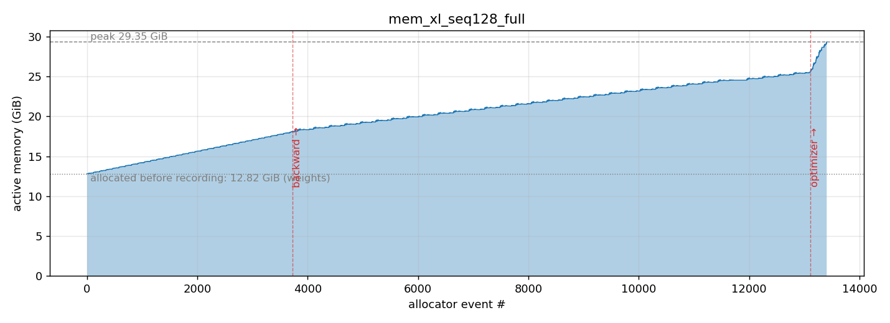
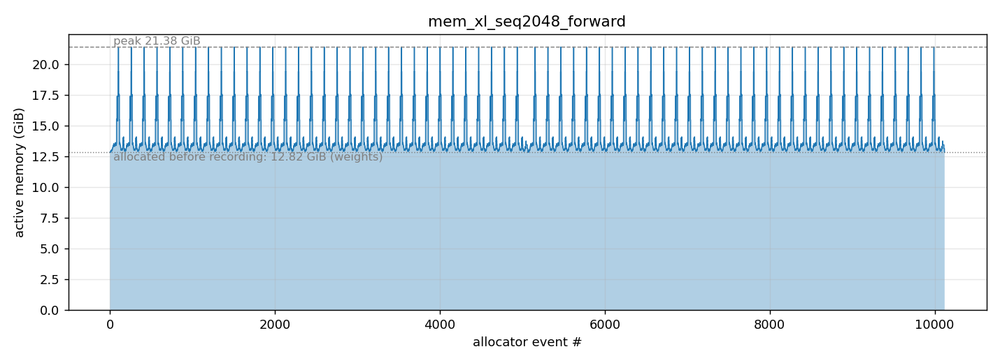

# CS336 A2 作答

> 每个 deliverable：1–2 句作答 + 一张佐证表。长分析、踩坑、设计取舍见 [blog_long.md](blog_long.md)。
> 硬件 RTX 5090 32 GB，torch 2.11.0+cu130，fp32 基准 `allow_tf32=False`；除注明外 `batch=4, seq=512`，warmup 5 / measure 10。

---

## 0 纸面账：五个 size 各是多大、要算多少、装不装得下、训多久

handout Table 1 的五个 size，`vocab=10000, seq=512, batch=4`，`d_head = d_model / num_heads = 64`（10B 是 128）：

| Size | d_model | d_ff | num_layers | num_heads | N |
|:-----|--:|--:|--:|--:|--:|
| small  |  768 |  3072 | 12 | 12 |  0.13B |
| medium | 1024 |  4096 | 24 | 16 |  0.42B |
| large  | 1280 |  5120 | 36 | 20 |  0.97B |
| xl     | 2560 | 10240 | 32 | 32 |  3.41B |
| 10B    | 4608 | 12288 | 50 | 36 | 12.83B |

参数量从真实模型在 meta device 上数，其余套公式（计算结果见 `assets/s2/paper_estimates.txt`）。

**公式**：每层参数 `4d² + 3·d·d_ff + 2d`（q/k/v/o、SwiGLU 三矩阵、两个 RMSNorm），加 `2·V·d`（embedding 与 lm_head 不共享）。
前向 FLOPs/token `= 2·(N − V·d) + 4·L·S·d`（矩阵乘 2N + attention 的 QKᵀ/PV），训练 `= 3×` 前向。

### 1. FLOPs

单位 FLOPs；每步 = 每 token × 2048。

| Size | N | 前向 / token | 训练 / token | 前向 / step | 训练 / step |
|:-----|--:|--:|--:|--:|--:|
| small  |  0.13B | 2.6e8 | 7.8e8 | 5.3e11 | 1.6e12 |
| medium |  0.42B | 8.8e8 | 2.6e9 | 1.8e12 | 5.4e12 |
| large  |  0.97B | 2.0e9 | 6.0e9 | 4.1e12 | 1.2e13 |
| xl     |  3.41B | 6.9e9 | 2.1e10 | 1.4e13 | 4.3e13 |
| 10B    | 12.83B | 2.6e10 | 7.8e10 | 5.3e13 | 1.6e14 |

attention 项在 seq=512 下只占 2–4%，`6N` 近似成立。

### 2. 显存

训练静态 = 16 B/参数（fp32 权重 4 + 梯度 4 + Adam m/v 8），autocast 再 +2；激活由 §2.1 实测反推（fwd_bwd 峰值 − 权重 − 梯度）。

| Size | 权重 (fp32) | 训练静态 | 激活（实测，seq 512） | 合计 | 32 GB？ |
|:-----|--:|--:|--:|--:|:--|
| small  |  0.5 GB |   1.9 |  3.1 |   5.0 | ✓ |
| medium |  1.6 |   6.3 |  7.4 |  13.7 | ✓ |
| large  |  3.6 |  14.4 | 13.1 |  27.5 | ✓（剩 4.5） |
| xl     | 12.7 |  50.8 |    — |     — | ✗ 静态就超 |
| 10B    | 47.8 | 191.2 |    — |     — | ✗ 权重就超 |

xl 卡在 Adam 状态（§2.5(b) 实测 OOM @ optimizer），10B 建模型即 OOM。

### 3. 训练 20N token 要多久

用 §2.1 实测 full step 步长反推：5090 fp32 实际 **3.3e13 FLOPs/s**（规格 1.05e14，MFU 31%，SIMT 路径）；bf16 autocast 按 §2.4(c) 的 fwd_bwd 加速换算。

| Size | 20N token | step (fp32) | fp32 | step (bf16) | bf16 |
|:-----|--:|--:|--:|--:|--:|
| small  |  2.6B |  52.8 ms |  18 h |  33 ms |  12 h |
| medium |  8.5B | 162.7 ms | 187 h（7.8 天） |  95 ms | 109 h（4.5 天） |
| large  | 19.4B | 371.5 ms | 977 h（41 天） | 195 ms | 511 h（21 天） |
| xl     | 68.1B | OOM | — | OOM | — |

单卡 5090 认真训的上限是 medium；large 一个多月，xl 装不下——这就是 §5–§7 多卡的理由。

---

## 2.1 Benchmarking Script

### (a) 脚本

`benchmark/`（`python -m benchmark`）：按 CLI 建 `BasicsTransformerLM`、随机批、预热 `w` 步后对 `n` 步计时，`--mode` 切 forward / fwd_bwd / full，每步 `cuda.synchronize()`。

### (b) 各阶段耗时

反向约为前向的 2 倍（2.02 / 2.02 / 1.93），optimizer 占 7%；测量很稳，标准差 ≤1.4%。xl 前向带图即 OOM，10B 建模型即 OOM。

| Size | forward | backward | optimizer | full |
|:-----|--------:|---------:|----------:|-----:|
| small  |  17.2 ± 0.4 |  34.8 |  3.7 |  55.7 ± 0.7 |
| medium |  51.1 ± 0.5 | 103.3 | 12.9 | 167.4 ± 1.6 |
| large  | 118.1 ± 0.3 | 227.8 | 26.9 | 372.8 ± 2.4 |
| xl     | OOM（no_grad 346.4） | — | — | — |

### (c) 不预热会怎样

不预热时首步比稳态慢 1.7–6.9×（绝对开销 ~300 ms，来自 kernel 懒加载、cuBLAS 初始化、显存池首次 cudaMalloc），10 步均值虚高 7–59%、标准差从 ~1 ms 涨到 ~100 ms；warmup=1 之后就稳了，模型越小坑越深。

| Size | w=0 | w=1 | w=5 |
|:-----|----:|----:|----:|
| small  |  88.4 ± 103.4 |  55.7 ± 0.5 |  55.7 ± 0.6 |
| medium | 196.8 ± 96.7  | 166.5 ± 0.9 | 167.2 ± 1.8 |
| large  | 400.9 ± 86.8  | 374.4 ± 2.8 | 375.1 ± 3.2 |

---

## 2.2 Nsight Systems Profiling

small + medium × seq 256 / 512 / 1024（large 只跑得到 512）。

### (a) 前向耗时与 timeit 对得上吗

对得上，nsys 系统性偏高 2.3–7.7%，相对开销随负载增大而缩小。

| | small 256 | small 512 | small 1024 | medium 256 | medium 512 | medium 1024 |
|:--|--:|--:|--:|--:|--:|--:|
| nsys   | 10.17 | 17.50 | 52.50 | 24.68 | 49.76 | 150.78 |
| timeit |  9.44 | 16.66 | 51.30 | 23.37 | 47.67 | 146.52 |
| 相对差 | +7.7% | +5.0% | +2.3% | +5.6% | +4.4% | +2.9% |

### (b) 最耗时的 kernel

六档都是 `cutlass_80_simt_sgemm_128x256_8x4_tn`（占前向 41–70%，单次前向 37–169 次）；加上反向仍是它（medium@1024 占 14.6%），反向 GEMM 散在三个 tile 变体上。

### (c) 非矩阵乘 kernel

elementwise（SwiGLU、RoPE、mask、残差）+ reduce（RMSNorm、softmax）占前向 18–49%，随 seq 急剧上升——它们访存受限，attention 中间张量随 seq² 涨。

| | small 256 | small 512 | small 1024 | medium 256 | medium 512 | medium 1024 |
|:--|--:|--:|--:|--:|--:|--:|
| matmul  | 79% | 77% | 51% | 81% | 75% | 53% |
| 非 matmul | 20% | 23% | 49% | 18% | 25% | 47% |

### (d) 完整训练步 vs 纯前向

完整步中 matmul 占比比前向低 6–18 pp（medium@256：81% → 64%），份额被 elementwise 吃掉（16% → 34%）：反向有大量梯度累加，AdamW 是纯逐元素。

### (e) attention 内 softmax vs 矩阵乘

softmax 比 FLOPs 相同的 `softQK·V` 矩阵乘慢 1.2–4.5×；`scores` 段（含 `/√d` 和 `masked_fill`）占 attention 的 61%，三段都卡在带宽。

| medium | seq 256 | seq 512 | seq 1024 |
|:--|--:|--:|--:|
| scores  | 11.1 ms (40%) | 28.4 (55%) | 91.9 (61%) |
| softmax |  1.8 (7%)     |  5.6 (11%) | 33.8 (22%) |
| matmul  |  1.7 (6%)     |  3.2 (6%)  |  7.6 (5%)  |

---

## 2.3 Mixed Precision Accumulation

精度由**累加器**的 dtype 决定，加数是什么无所谓：fp16 累加器漂到 9.95，bf16 累加器（7 位尾数）在 4.0 就再也加不动；fp32 累加器无论加数是 fp16/bf16 还是手动转过，都落在 10.00x（偏差来自 0.01 在 16 位里本身存不准）。

| 累加 | 结果 |
|:--|--:|
| `s(fp32) += x(fp32)` | 10.0001 |
| `s(fp16) += x(fp16)` | 9.9531 |
| `s(fp32) += x(fp16)`（自动/手动升精度） | 10.0021 |
| `s(bf16) += x(bf16)` | **4.0000** |
| `s(fp32) += x(bf16)` | 10.0098 |

---

## 2.4 Benchmarking Mixed Precision

### (a) fp16 autocast 下各组件 dtype

参数 fp32（autocast 不改存储的权重，只在算子调用时转换输入）；fc1 输出与 logits fp16；LayerNorm 输出、loss、梯度 fp32。bf16 下模式相同。

| 参数 | fc1 输出 | ln 输出 | logits | loss | 梯度 |
|:--|:--|:--|:--|:--|:--|
| fp32 | fp16 | fp32 | fp16 | fp32 | fp32 |

### (b) LayerNorm 为什么特殊

敏感的是特征维上的**归约**（均值/方差累加）和方差里的**平方**（fp16 上限 65504 易溢出）。换 bf16 后溢出消失，但尾数只有 7 位、归约精度比 fp16 更差（§2.3 卡在 4.0 就是它），所以仍需保留 fp32，理由从「怕溢出」变成「怕精度」；LayerNorm 只占前向 2–7%，保留 fp32 基本免费。

### (c) bf16 vs fp32

bf16 autocast 前向快 1.9–2.3×、反向快 1.7–1.9×，**模型越大加速越高**（大 GEMM 更接近 Tensor Core 峰值）；反向低于前向是因为梯度累加进 fp32 `.grad` 不缩水。xl 在 bf16 下仍 OOM。加速比含两个效应：位宽减半 + fp32 基准走 SIMT 而 bf16 走 Tensor Core。

| Size | forward fp32 → bf16 | 加速 | backward fp32 → bf16 | 加速 | 峰值显存 |
|:-----|:--|--:|:--|--:|:--|
| small  |  17.2 →  9.2 | 1.87× |  33.9 →  20.1 | 1.69× | −21% |
| medium |  50.1 → 24.4 | 2.05× | 102.3 →  57.3 | 1.79× | −20% |
| large  | 114.8 → 49.9 | **2.30×** | 220.0 → 117.6 | 1.87× | −18% |
| xl     | OOM → OOM | — | — | — | — |

---

## 2.5 Memory Profiling

xl，`batch=4`，`max_memory_allocated`（预热后清零）。

### (a) 显存时间线

能认出阶段，靠的是**斜率**而不是峰：前向是 32 级均匀上坡（每层存一份反向要用的激活，12.8 → 18.1 GB），反向坡度变缓但仍在爬（每层释放 ~140 MB 激活、同时分配 ~315 MB 梯度，净增），optimizer 一开始就垂直冲到 29.35 GB OOM（AdamW 分配 m/v）。纯前向（no_grad）几乎是平的——xl@128 只在 12.8 GB 基线上多 0.08 GB 临时量。

> 图从 `--memory-snapshot` 的 pickle 直接画（与 memory_viz 同一份 alloc/free 事件），红线是阶段分界（反向的分配没有 Python 栈、optimizer 的栈里有 `optimizer.py`）；最大分配清单见 `assets/s2/memory_top_allocs.txt`。

### (b) 峰值显存

xl 的完整训练步在 32 GB 上**任何 seq 都装不下**：不是激活，是 AdamW 第一次 `step()` 要分配 2 × 13.6 GB 状态（权重 + 梯度 + 状态 = 54 GB）。

| seq | forward（no_grad） | fwd_bwd | full |
|----:|------:|------:|:-----|
| 128  | 12.90 | 25.56 | OOM @ optimizer（29.35） |
| 2048 | 21.38 | OOM @ forward（25.96） | OOM @ forward |

### (c) 混合精度的影响

**不省反多 4–6 GB**：no_grad 前向 12.9 → 19.2 GB（128）、21.4 → 25.3 GB（2048），多出的是一份 bf16 权重副本（3.4B × 2 B = 6.8 GB）减去激活省下的 1–2 GB；fwd_bwd 持平（25.56 vs 25.55）。副本在推理时是 autocast 的 cast 缓存（可关，或干脆 `model.to(bf16)`），训练时是反向 `dx = dy·Wᵀ` 的输入（autograd 存的 saved tensor，关缓存也省不掉）。只有激活远大于权重时 autocast 才省显存（§2.4(c) 里 small 省 21%）。

| seq | 模式 | fp32 | bf16 |
|----:|:--|--:|--:|
| 128  | forward（no_grad） | 12.90 | 19.18 |
| 128  | fwd_bwd | 25.56 | 25.55 |
| 2048 | forward（no_grad） | 21.38 | 25.27 |

### (d) 残差流张量大小

`[batch, seq, d_model] × 4 B = 4 × 2048 × 2560 × 4 = 83,886,080 B = 80 MiB`（seq=128 时 5 MiB）；每 token 10 KiB。

### (e) 最大的几笔分配

xl@2048 前向最大的分配是 **2 GiB**，全部来自 attention 的 `[4, 32, 2048, 2048]` fp32 分数矩阵——每层临时造 6 份（`QKᵀ` einsum、`/√d`、`masked_fill`、softmax 里的 `x − max`、`exp`、除法），调用栈指向 `model.py:253-257` 和 `nn_utils.py:15-24`；次大的 320 MiB 是 SwiGLU 的 `[4, 2048, 10240]` 中间量。残差流本身（80 MiB）排不进前列。

| 大小 | 每层次数 | 来源 |
|--:|--:|:--|
| 2048 MiB | 6 | attention 分数矩阵 `[b, h, s, s]`：einsum、缩放、mask、softmax 三步 |
|  320 MiB | 4 | SwiGLU 中间量 `[b, s, d_ff]`：w1、w3、SiLU、门积 |
|   80 MiB | — | 残差流 `[b, s, d]` |

> seq=128 时排序反过来：最大的是 SwiGLU 的 20 MiB，attention 分数只有 8 MiB。分数矩阵随 seq² 涨、其它随 seq 线性涨，seq 一长 attention 就成了显存主角——这是 §4 FlashAttention 的动机。

### (f) 单层 TransformerBlock 为反向保存的显存

xl@128（fwd_bwd，fp32）的 block5 在前向 range 内一共 `cudaMalloc` 了 288 MiB，其中 **166 MiB、25 个张量**在 range 结束时还没释放——这就是为反向保存的 residual，占该层前向分配的 58%。按包着每次分配的最内层 `aten::*` range 归因，前五个来源占 residual 的 90%：`aten::mul` 60 MiB（36%，SwiGLU 的门积和 SiLU 的 `x·σ(x)`，`[4,128,10240]` fp32 各 20 MiB）、`aten::bmm` 40 MiB（24%，attention 的 q/k/v 与 `softmax·V`）、`aten::empty` 20 MiB（12%，`w1(x)`/`w3(x)` 的输出，einsum 先 `empty` 再写入）、`aten::sigmoid` 20 MiB（12%，SiLU 里的 `σ(x)`）、`aten::add` 10 MiB（6%，残差相加）。算子名要读成「malloc 发生时正在跑的算子」而非「张量属于谁」。可以看到大头是 FFN 的 `d_ff` 宽中间量而不是 attention——seq=128 时 `[b,h,s,s]` 分数矩阵只有 8 MiB，§2.5(e) 里 seq=2048 时它才变成 2 GiB 的主角。

反向时用 `emit_nvtx` 的 `seq` 编号把 block5 的反向算子对回来（反向在 autograd 工作线程上跑，自己插的 range 覆盖不到），这一段窗口内分配 1203 MiB、释放 954 MiB，**净增 249 MiB**；其中释放的 954 MiB 里有 161 MiB 是上面那些 residual。所以反向新产生的张量 = 净增 + 释放的 residual = **410 MiB**。预期值：这一层 104.9M 参数的权重梯度 × 4 B = 400 MiB，加上传给前一层的输入梯度 `[4,128,2560]` × 4 B = 5 MiB，合 405 MiB，误差 1%——符合预期。这也解释了 §2.5(a) 时间线里反向为什么"不下坡"：每层释放 166 MiB、新增 410 MiB，净值必然继续爬。

| 来源算子 | residual | 占比 | 是什么 |
|:--|--:|--:|:--|
| `aten::mul`     | 60 MiB | 36% | SwiGLU 的门积和 SiLU 的 `x·σ(x)`（`[4,128,10240]` 各 20 MiB） |
| `aten::bmm`     | 40 MiB | 24% | attention 的 q/k/v 与 `softmax·V` 输出 |
| `aten::empty`   | 20 MiB | 12% | FFN 线性层的输出本身（einsum 先 `empty` 再由 GEMM 写入，malloc 落在 `empty` 的 range 里） |
| `aten::sigmoid` | 20 MiB | 12% | SiLU 里的 `σ(x)` |
| `aten::add`     | 10 MiB |  6% | 残差相加 |

> 采法：`PYTORCH_NO_CUDA_MEMORY_CACHING=1` + `nsys --cuda-memory-usage=true`，`--nvtx-ops` 给每层打 `block{i}` range、`emit_nvtx` 给每个 aten 算子打带 `seq` 编号的 range；归因脚本 `python -m benchmark.memory`。不关 caching allocator 的话 nsys 只看到显存池的增长，看不到单个张量。
> 关了 caching 后 `cudaFree` 过的地址会被复用，分配和释放要按「之后的第一次 free」配对，直接按地址集合会多算 60 MiB。

> 图从 nsys 的 sqlite 导出直接画（`CUDA_GPU_MEMORY_USAGE_EVENTS` + `NVTX_EVENTS`，与 GUI 同源）：上图整步的 cudaMalloc/cudaFree 曲线和每层 range，下图放大 block5 前向，红点是活到 range 结束的分配。
