# 单卡 5090 上的 Transformer 训练：算力、显存与 checkpoint

Stanford CS336《Language Modeling from Scratch》作业 2「Systems」的实验记录。模型是作业 1 里从零写的 Transformer LM（RMSNorm + RoPE + SwiGLU，pre-norm），本篇覆盖作业的 §2 Profiling & Benchmarking 和 §3 Single-GPU Memory（§2、§3 沿用作业编号，作业的 2.1 计时和 2.2 nsys 合成 §2.1「时间」，2.4 显存剖析提到 §2.2，2.3 混合精度放最后为 §2.3——先看时间、再看显存、最后看混合精度怎么改这两者；§1 是自己加的背景和纸面估算）。每小节先一句话说清问题，再 1–2 句作答加一张佐证表。

> 硬件 RTX 5090 32 GB（`torch` 可用 31.3 GiB；下文显存一律 GiB = 2³⁰ B，即 `max_memory_allocated()/1024³`），torch 2.11.0+cu130，fp32 基准 `allow_tf32=False`；除注明外 `batch=4, seq=512`，warmup 5 / measure 10。

## 省流不看

1. **先算纸面账再开机**（§1）：训练算力 ≈ 6 × 参数量 × token 数；训练静态显存 16 B/参数（fp32 权重 4 + 梯度 4 + AdamW 状态 8）。3.41B 参数的模型（作业的 xl）静态就 50.8 GiB，5090 的 31.3 GiB 装不下。纸面账偏保守一个 W：`.grad` 在 step 后释放、反向时才逐层重建（PyTorch 2.0 默认 `set_to_none=True`），activation 和梯度不会同时全在，实测峰值是 W + max(A, G) 而非 W + G + A（§2.2）。按 Chinchilla 的 20 token/参数 训到收敛、实测算力利用率 31% 反推：0.42B 模型（作业的 medium）要 8 天，0.97B（large）要 41 天。单卡 5090 一周内能训完的最大模型约 0.4B。
2. **不预热的计时数字没意义**（§2.1）
   - 现象：进程第一步比稳态慢 1.7–6.9×，绝对值 ~300 ms 且与模型大小无关；平均进去后 10 步均值虚高 7–59%、标准差从 1 ms 涨到 100 ms，模型越小失真越大。
   - 原因：第一步要做一批一次性的事——GPU kernel 首次加载进显存、cuBLAS 建句柄、显存池第一次向驱动要内存。这是进程级开销，和模型算得快慢无关，却全记在第一步上；不剔除，比较的就是「谁先启动」而不是「谁算得快」。
   - 做法：先空跑 1 步再计时。计时用 `timeit` + `torch.cuda.synchronize()` 回答「多快」，用 Nsight Systems 看时间线回答「时间花在哪」。
3. **GPU 时间看的是「张量被搬了几遍」，不是 FLOPs**（§2.1）
   - 现象：seq 从 256 到 1024，前向里矩阵乘的占比从 82% 掉到 54%，让出的份额全被 attention 里几个几乎不算数的操作吃掉——softmax（hw1 版拆成 5 个 kernel，把 256 MiB 的分数矩阵 S 读写 8 遍）用了 PV 矩阵乘 6× 的时间；`/√d` 和 causal mask 各把 S 读写一遍，两个「零 FLOPs」操作加起来抵一次矩阵乘。
   - 原因：eager 模式每个算子是独立 kernel，都要把整个张量过一遍显存；这些 op 的算术强度（FLOPs / bytes）远低于 5090 的 60，时间 = bytes / 带宽，与 FLOPs 无关；S 是 seq² 大，seq 翻 4 倍它们翻 16 倍，矩阵乘只翻 4 倍。
   - 做法：融合，让 S 少落几次显存（fused softmax、FlashAttention）。
4. **bf16 混合精度：快 2×、省 20% 显存，代价是归约精度**（§2.3）
   - 现象：bf16 autocast 前向快 1.9–2.3×、反向 1.7–1.9×，模型越大越快；训练峰值显存省 18–21%。但 `s += 0.01` 用 bf16 累加器到 4.0 就加不动，fp16 累加器漂到 9.95。
   - 原因：加速是两个效应相乘——搬的 bytes 减半，以及纯 fp32 矩阵乘只能走 CUDA core、bf16 才能进 Tensor core（5090 快 2×，H100 快 15×）。显存是两项相抵——autocast 把 fp32 权重转成 bf16 副本再算、反向存的是副本（+参数量 × 2 B），而为反向存的 activation 变成 bf16（约减 1/3）；训练时 activation 远大于权重所以净省，权重占大头时（3.41B 模型只喂 512 个 token 的纯前向）反而多 6.3 GiB；训练的峰值在反向末尾，那时副本已释放，所以副本顶的是前向。精度问题在累加器：bf16 只有 7 位尾数，4.0 + 0.01 舍回 4.0，加数是什么无所谓。
   - 做法：归约类算子（LayerNorm / RMSNorm 的均值方差、softmax 的求和、loss）留在 fp32——autocast 默认就这么做，它们只占前向 2–7%，基本免费；矩阵乘用 bf16 吃全部加速。
5. **autograd 为反向存什么**（§3.1）：一个算子的局部导数里出现什么张量就存什么，存的是引用不是拷贝。RMSNorm 拆成 5 个算子，真正多占显存的只有归一化系数 r 和归一化后的 x̂；`torch.compile` 把 5 个算子融合成 1 个后，x̂ 不再存、反向时重算。
6. **显存大头是 attention**（§2.2/§3.1）：3.41B 模型、序列 2048，一层 Transformer block 为反向存 3655 MiB，其中 56% 是 attention 分数矩阵 S = QKᵀ 和概率矩阵 P = softmax(S)——两个 `[batch, heads, seq, seq]` 张量，随序列长度平方增长，32 层合计 114 GiB。
7. **激活检查点（activation checkpointing）是推迟不是压缩**（§3.2）：前向只留每段的输入，反向到该段时重算段内张量。峰值显存 = 所有段输入 + 一段的中间张量；不管怎么分段都恰好多算一次前向（实测慢 28–33%）。Transformer 每层中间张量远大于层输入，所以最省显存的分法就是每层一段，段长没有最优的中间值；教科书上的递归二分能把显存压到 O(log 层数) 但计算涨到 O(层数 · log 层数)，实践不用。
8. **检查点动不了 S 和 P**：反向重算时它们仍要完整落在显存里。要消掉得改 attention 的 kernel 本身——[第二篇](blog2.md) FlashAttention。

---

## 1 背景与纸面账

### 1.1 术语

全文统一用英文术语：

**表 1-1** 全文术语

| 术语 | 含义 |
|:--|:--|
| **activation** | 前向算出的任何中间张量，不管存不存 |
| **saved tensors** | 其中 autograd 为反向留下的那部分（PyTorch `saved_tensors_hooks` 看到的就是它们）。作业文档和 JAX 叫 **residuals**，本文不用这个词，以免和 residual connection 混 |
| **entry** | 一段 checkpoint 的输入 x_i（`[b, s, d]`，80 MiB），checkpoint 唯一保留的东西，反向 recompute 的起点 |
| **recompute**（重算） | 反向时用 entry 把一段前向重跑一遍 |
| **residual stream**（残差流） | Transformer 里逐层相加的那条 `[batch, seq, d_model]` 主干，与上面的 residuals 无关 |
| **forward / fwd_bwd / full** | benchmark 的三种模式：纯前向（`no_grad`）/ 前向 + 反向 / 前向 + 反向 + optimizer step |
| **kernel / op** | kernel = GPU 上执行的一个函数（nsys 看到的单位）；op = PyTorch 的 aten 算子，一个 op 可能发多个 kernel |
| **matmul / GEMM** | 矩阵乘；GEMM 是 cuBLAS/cutlass 里矩阵乘 kernel 的名字 |
| **CUDA core / Tensor core** | 一个 SM 里的两种算术单元。CUDA core（SIMT）是标量 FMA，什么都能算，5090 fp32 峰值 1.05e14 FLOPS；Tensor core 只做小矩阵块乘加，只收 fp16 / bf16 / tf32 / fp8 输入，吞吐高一个量级（5090 bf16 2.1e14，H100 上比 CUDA core 高 15×）。纯 fp32 矩阵乘走不了 Tensor core；**tf32** 是把 fp32 尾数截到 10 位后送进 Tensor core 的后门，`allow_tf32=False` 就是关掉它。nsys 里 kernel 名带 `simt` 的走 CUDA core |
| **FLOPs / FLOPS** | FLOPs = 浮点运算次数（计数，如 8.6e9）；FLOPS = 每秒浮点运算次数（速率，如 1.05e14）。全文用 10 的幂写，不用 G/T 前缀 |
| **🟦 W / 🟥 G / 🟩 A / 🟨 T** | 显存四项（§2.2，颜色与图 2.2-1 一致）：🟦 W = 全部权重的大小；🟥 G = 全部参数梯度 `.grad` 的大小，= W——但不常驻：`zero_grad(set_to_none=True)` 下 step 后释放，下一步反向时逐层重建，所以在图里是楔形不是底座；🟩 A = 前向结束时为反向存的全部 saved tensors；🟨 T = 正在算的这一层的临时量，算完即释放：前向是 attention 分数矩阵链那种尖峰，反向是 `dy`、`dx`、累加前的 `dW` |
| **L / j / M(j)** | L = 层数；j = 反向已走完的层数（0 → L）；M(j) = 此刻活着的显存 = 🟦W + 🟥G·j/L + 🟩A·(L−j)/L + 🟨T |
| **k** | checkpoint 段数，每段 L/k 层（§3.2） |
| **算术强度 I**（arithmetic intensity） | FLOPs / 读写显存的 bytes。低于硬件的 FLOPS / 带宽（5090 fp32 ≈ 60）的 op 受限于带宽，时间 = bytes / 带宽 |

### 1.2 模型规格

作业给定的五个模型规格（下文 small / medium / large / xl / 10B），`vocab=10000, seq=512, batch=4`，`d_head = d_model / num_heads = 64`（10B 是 128）：

**表 1-2** 作业给定的五个模型规格

| Size | d_model | d_ff | num_layers | num_heads | N |
|:-----|--:|--:|--:|--:|--:|
| small  |  768 |  3072 | 12 | 12 |  0.13B |
| medium | 1024 |  4096 | 24 | 16 |  0.42B |
| large  | 1280 |  5120 | 36 | 20 |  0.97B |
| xl     | 2560 | 10240 | 32 | 32 |  3.41B |
| 10B    | 4608 | 12288 | 50 | 36 | 12.83B |

参数量从真实模型在 meta device 上数，其余套公式（计算结果见 `assets/s0/paper_estimates.txt`）。

**公式**：每层参数 `4d² + 3·d·d_ff + 2d`（q/k/v/o、SwiGLU 三矩阵、两个 RMSNorm），加 `2·V·d`（embedding 与 lm_head 不共享）。
前向 FLOPs/token `= 2·(N − V·d) + 4·L·S·d`（矩阵乘 2N + attention 的 QKᵀ/PV），训练 `= 3×` 前向。

### 1.3 FLOPs

两种口径：**/ token** 是处理一个 token 的 FLOPs，只和模型大小有关（前向 ≈ 2N，训练 ≈ 6N）；**/ step** 是一个训练步的 FLOPs = / token × 一步的 token 数，这里 batch 4 × seq 512 = 2048。前者用来对 6N 公式、算 20N token 的总量，后者除以实测 step 时间得到吞吐（§1.5）。

**表 1-3** 纸面 FLOPs：每 token 与每 step（batch 4 × seq 512）

| Size | N | 前向 / token (FLOPs) | 训练 / token (FLOPs) | 前向 / step (FLOPs) | 训练 / step (FLOPs) |
|:-----|--:|--:|--:|--:|--:|
| small  |  0.13B | 2.6e8 | 7.8e8 | 5.3e11 | 1.6e12 |
| medium |  0.42B | 8.8e8 | 2.6e9 | 1.8e12 | 5.4e12 |
| large  |  0.97B | 2.0e9 | 6.0e9 | 4.1e12 | 1.2e13 |
| xl     |  3.41B | 6.9e9 | 2.1e10 | 1.4e13 | 4.3e13 |
| 10B    | 12.83B | 2.6e10 | 7.8e10 | 5.3e13 | 1.6e14 |

attention 项在 seq=512 下只占 2–4%，`6N` 近似成立。

### 1.4 显存

训练静态 = 16 B/参数（fp32 权重 4 + 梯度 4 + Adam m/v 8），autocast 再 +2；activation（为反向存的 saved tensors，§2.2 记作 A）由 §2.2 实测反推：带图前向峰值 − 权重。单位 GiB：

**表 1-4** 纸面显存 vs 实测 full 峰值（GiB）

| Size | 权重 W | 训练静态 4W | activation A（实测，batch 4 seq 512） | 纸面峰值 4W + A | 实测 full 峰值 | 31.3 GiB？ |
|:-----|--:|--:|--:|--:|--:|:--|
| small  |  0.5 |   1.9 |  3.5 |   5.4 |  5.0 | ✓ |
| medium |  1.6 |   6.3 |  8.9 |  15.2 | 13.7 | ✓ |
| large  |  3.6 |  14.4 | 16.6 |  31.0 | 27.5 | ✓（纸面几乎贴边，实测剩 3.8） |
| xl     | 12.7 |  50.8 |    — |     — | OOM | ✗ 静态就超 |
| 10B    | 47.8 | 191.2 |    — |     — | OOM | ✗ 权重就超 |

实测比纸面少一个 W：峰值出现在前向末尾（A 全在），那一刻上一步的 `.grad` 已被 `zero_grad(set_to_none=True)` 释放、本步的还没算出来，所以真正同时在显存里的是 3W + A（§2.2 开头的表）。纸面账按 4W 算是保守的上界。xl 卡在 Adam 状态（§2.2(b) 实测 OOM @ optimizer），10B 建模型即 OOM。

### 1.5 训练 20N token 要多久

用 §2.1 实测 full step 步长反推：5090 fp32 实际 **3.3e13 FLOPS**（规格 1.05e14，MFU 31%，SIMT 路径）；bf16 autocast 按 §2.3(d) 的 fwd_bwd 加速换算。

**表 1-5** 训 20N token 的时长估算（MFU 31%）

| Size | 20N token | step (fp32) | 总时长 fp32 | step (bf16) | 总时长 bf16 |
|:-----|--:|--:|--:|--:|--:|
| small  |  2.6B |  52.8 ms |  18 h |  33 ms |  12 h |
| medium |  8.5B | 162.7 ms | 187 h（7.8 天） |  95 ms | 109 h（4.5 天） |
| large  | 19.4B | 371.5 ms | 977 h（41 天） | 195 ms | 511 h（21 天） |
| xl     | 68.1B | OOM | — | OOM | — |

单卡 5090 认真训的上限是 medium；large 一个多月，xl 装不下——这就是作业后半段（§5–§7）要上多卡的理由。

---

## 2 性能剖析与基准（Profiling & Benchmarking）

### 2.1 时间花在哪（Benchmarking & Profiling）

#### (a)–(c) 整步：timeit 计时

**(a) 脚本**

**问题**：写一个端到端 benchmark，能选模型规格、预热后计时 forward / fwd_bwd / full 三种模式。

`benchmark/`（`python -m benchmark`）：按 CLI 建 `BasicsTransformerLM`、随机批、预热 `w` 步后对 `n` 步计时，`--mode` 切 forward / fwd_bwd / full，每步 `cuda.synchronize()`。

**(b) 各阶段耗时**

**问题**：五个规格各跑 10 步，前向、反向、optimizer 各占多少时间，测量稳不稳。

反向约为前向的 2 倍（2.02 / 2.02 / 1.93），optimizer 占 7%；测量很稳，标准差 ≤1.4%。xl 前向带图即 OOM，10B 建模型即 OOM。

**表 2.1-1** 各规格 full step 各阶段耗时（ms，batch 4 seq 512，warmup 5 / measure 10）

| Size | forward (ms) | backward (ms) | optimizer (ms) | full (ms) |
|:-----|--------:|---------:|----------:|-----:|
| small  |  17.2 ± 0.4 |  34.8 |  3.7 |  55.7 ± 0.7 |
| medium |  51.1 ± 0.5 | 103.3 | 12.9 | 167.4 ± 1.6 |
| large  | 118.1 ± 0.3 | 227.8 | 26.9 | 372.8 ± 2.4 |
| xl     | OOM（no_grad 346.4） | — | — | — |

**(c) 不预热会怎样**

**问题**：去掉 warmup、或只预热 1–2 步，均值和方差变成什么样，为什么。

不预热时首步比稳态慢 1.7–6.9×（绝对开销 ~300 ms，来自 kernel 懒加载、cuBLAS 初始化、显存池首次 cudaMalloc），10 步均值虚高 7–59%、标准差从 ~1 ms 涨到 ~100 ms；warmup=1 之后就稳了，模型越小坑越深。

**表 2.1-2** 预热步数对 full step 均值 ± 标准差的影响（ms）

| full step (ms) | w=0 | w=1 | w=5 |
|:-----|----:|----:|----:|
| small  |  88.4 ± 103.4 |  55.7 ± 0.5 |  55.7 ± 0.6 |
| medium | 196.8 ± 96.7  | 166.5 ± 0.9 | 167.2 ± 1.8 |
| large  | 400.9 ± 86.8  | 374.4 ± 2.8 | 375.1 ± 3.2 |

#### (d)–(h) 逐 kernel：Nsight Systems 剖析

用 NVIDIA Nsight Systems（`nsys`）采 GPU kernel 级 timeline，代码里用 NVTX range 标出 forward / backward / optimizer 各段。覆盖 small + medium × seq 256 / 512 / 1024（large 只跑得到 512）。

**(d) 前向耗时与 timeit 对得上吗**

**问题**：nsys 里 forward range 的宽度和上面用 `timeit` 量的一致吗。

对得上，nsys 系统性偏高 2.3–7.7%，相对开销随负载增大而缩小。

**表 2.1-3** nsys forward range 宽度 vs timeit（ms）

| forward (ms) | small 256 | small 512 | small 1024 | medium 256 | medium 512 | medium 1024 |
|:--|--:|--:|--:|--:|--:|--:|
| nsys   | 10.17 | 17.50 | 52.50 | 24.68 | 49.76 | 150.78 |
| timeit |  9.44 | 16.66 | 51.30 | 23.37 | 47.67 | 146.52 |
| 相对差 | +7.7% | +5.0% | +2.3% | +5.6% | +4.4% | +2.9% |

**(e)–(h) kernel 分析：GPU 时间花在哪**

**问题**：(e) 最耗时的 kernel 是哪个，加上反向还是它吗；(f) 矩阵乘之外还有什么占时间；(g) 算上 optimizer 后矩阵乘占比怎么变；(h) attention 内部 softmax 和两次矩阵乘各花多少，和 FLOPs 相称吗。

**第一步：kernel 归类**。nsys 报表里的 kernel 名是 C++ 模板签名，按关键字归三类（占比取 medium@512 full step 的 GPU 时间）：

**表 2.1-4** nsys kernel 按名字归三类（medium@512 full step 占比）

| 类别 | kernel 名 | 对应模型里的操作 | 占比 |
|:--|:--|:--|--:|
| **matmul** | `cutlass_80_simt_sgemm`<br>`magma_sgemmEx` | 所有 `Linear` 的前向与反向（`sgemm` = fp32 GEMM，`simt` = 走 CUDA core）<br>attention 的 QKᵀ / PV：batched GEMM，cuBLAS 选了源自 MAGMA 库的 kernel，同是矩阵乘 | 60% |
| **elementwise** | `elementwise_kernel<MulFunctor>`<br>`elementwise_kernel<add>`<br>`elementwise_kernel<DivFunctor>`<br>`direct_copy_kernel`<br>`masked_fill_kernel`<br>`exp_kernel` / `neg_kernel`<br>`sigmoid_backward`<br>`addcdiv` / `addcmul` / `sqrt_kernel` | SwiGLU 门积、RMSNorm 的 w⊙x̂、`/√d`<br>残差加、梯度累加、softmax 减 max<br>softmax 归一化<br>`.contiguous()` / 转置<br>causal mask<br>softmax 的 exp 及其反向<br>SiLU 反向<br>AdamW 更新 | 39% |
| **reduce** | `reduce_kernel<sum_functor>`<br>`reduce_kernel<MaxOps>` | RMSNorm 的 Σx²、softmax 的 Σexp、反向对 batch 维求和<br>softmax 的 max | 2% |

**第二步：整步按类别**。

**表 2.1-5** GPU 时间按类别占比（medium）

| medium | forward 256 | forward 512 | forward 1024 | full step 256 | full step 512 |
|:--|--:|--:|--:|--:|--:|
| GPU 时间 / 步 | 22.5 ms | 45.5 ms | 138.7 ms | 81 ms | 166 ms |
| **matmul** | **82%** | **75%** | **54%** | **65%** | **60%** |
| elementwise | 16% | 23% | 40% | 34% | 39% |
| reduce | 2% | 2% | 6% | 1% | 2% |

- **(e) 最耗时的 kernel** 是 `cutlass_80_simt_sgemm_128x256_8x4_tn`：前向占 45–54%，加上反向和 optimizer 后仍是第一但只剩 17%。名字拆读：`128x256` 是每个 thread block 负责的输出分块，`tn` 是两个输入的布局（第一个转置）。cuBLAS 按矩阵形状和布局选 tile，同是 Linear 的矩阵乘会散在几个名字下；用每步实例数（24 层 × 7 个 Linear + lm_head = 169）能对出各是哪一步：

  **表 2.1-5a** GEMM kernel 名 ↔ 前向 / 反向哪一步（medium@512 full step）

  | kernel | 每步次数 | 对应 |
  |:--|--:|:--|
  | `sgemm_128x256_tn` + `sgemm_256x128_tn` | 73 + 96 = 169 | 前向 y = x·Wᵀ（W 存成 `[out, in]`，故转置） |
  | `sgemm_256x128_nn` | 169 | 反向 dx = dy·W |
  | `sgemm_128x128_nt` + `sgemm_128x64_nt` | 73 + 96 = 169 | 反向 dW = dyᵀ·x |

  73 / 96 是 d_model 宽的 QKVO 投影和 d_ff 宽的 FFN 矩阵分到了不同 tile。所以「最大 kernel」就是 Linear 的前向矩阵乘；full step 里它的份额被 dx、dW 两组各 169 次的反向 GEMM 分走。
- **(f) 矩阵乘之外**是 elementwise + reduce，前向占比从 18%（seq 256）涨到 46%（seq 1024）。它们 FLOPs 极少，占时间是因为每个 kernel 都要把张量完整读一遍写一遍，而 attention 的中间张量随 seq² 涨——第三步量化。
- **(g) 算上 optimizer**，matmul 占比比前向低 15–17 个百分点，让出的份额被 elementwise 吃掉：反向的梯度累加和 AdamW 的更新全是逐元素。small 同样趋势（forward 1024：matmul 51%）。

**第三步：attention 内部**。把 attention 拆三段——scores（QKᵀ、/√d、mask）、softmax、PV——按 kernel 名把每段的 GPU 时间加起来（24 层合计），占整个 forward 的比例。不能直接用 NVTX 段过滤：range 是 CPU 侧打的，seq 长时 GPU 还在跑上一段的 kernel，CPU 已进入下一段，nsys 会把投影 GEMM、RoPE 算进 scores 段（seq 1024 时多算了 10 ms）。

**表 2.1-6** attention 三段的 GPU 时间与占 forward 的比例（medium，按 kernel 名归因）

| medium forward | seq 256 | seq 512 | seq 1024 |
|:--|--:|--:|--:|
| scores（QKᵀ + /√d + mask） | 0.9 ms (4%) | 3.6 (8%) | 25.1 (18%) |
| softmax | 1.0 (4%) | 5.0 (11%) | 34.3 (24%) |
| PV | 0.4 (2%) | 1.6 (3%) | 5.5 (4%) |
| 其余（QKVO 投影、RoPE、FFN、RMSNorm、残差加） | 21.1 (90%) | 37.2 (78%) | 76.8 (54%) |

- **(h) 不相称**。seq 1024：PV 矩阵乘 FLOPs 8.6e9、5.5 ms；softmax FLOPs 1.8e9、34.3 ms——FLOPs 少 5 倍的反而慢 6 倍。scores 段同理，QKᵀ 本身 7.1 ms 和 PV 相当，多出的 18 ms 是 `/√d` 和 mask 两个逐元素 op。三段合计 10% → 46%，增量全在这些几乎不算数的 kernel 上。为什么，第四步。

**第四步：逐 op 的 roofline——为什么**。每个 op 有两个「至少要多久」：
- 算力下限 = FLOPs / 1.05e14（5090 fp32 峰值）
- 带宽下限 = bytes / 1.79e12（显存带宽）

实际耗时 ≥ 两者取大：算力下限大是 **compute-bound**，带宽下限大是 **memory-bound**（等价于算术强度 I = FLOPs / bytes 是否低于 ridge point ≈ 60）。下表 medium@1024 一层内各 op，前 4 列纸面算、「实测」是 nsys 里对应 kernel 的 GPU 时间（按 kernel 名归因，24 层平均）、粗体是瓶颈（S 是 `[4,16,1024,1024]`，4·16·1024² = 6.7e7 个元素 × 4 B = 256 MiB）：

**表 2.1-7** 逐 op roofline：FLOPs、bytes、两个下限、实测与利用率（medium@1024 一层）

| op（形状，每行 = 一层内一次调用） | FLOPs | 读写 bytes | I | 算力下限 FLOPs/P | 带宽下限 bytes/B | 实测 | 利用率 = 粗体 / 实测 |
|:--|--:|--:|--:|--:|--:|--:|--:|
| 普通 Linear 作参照：y = x·Wᵀ（FFN 的 w1，x `[4096 token, 1024]`，W `[4096, 1024]`，y `[4096, 4096]`） | 2·4096·1024·4096 = 3.4e10 | 读 x 4096·1024·4 B = 16 MiB + W 16 MiB，写 y 4096·4096·4 B = 64 MiB，共 96 MiB | 340 | **0.32 ms** | 0.06 ms | ≈ 0.5 ms | MFU 64% |
| S = QKᵀ（Q、K 各 `[64 个 batch×head, 1024, 64]`，S `[64, 1024, 1024]`） | 64·(2·1024·64·1024) = 8.6e9 | 读 Q + K 2·(64·1024·64·4 B) = 32 MiB，写 S 64·1024²·4 B = 256 MiB，共 288 MiB | 28 | 0.08 ms | **0.17 ms** | 0.30 ms | MBU 57% |
| S / √d（逐元素缩放，输出新张量） | 1 × 6.7e7 个元素 = 6.7e7 | 读 S 256 MiB + 写 S 256 MiB = 512 MiB | 0.13 | 0.0006 ms | **0.30 ms** | 0.35 ms | MBU 86% |
| masked_fill（causal mask 填 −inf） | 0 | 读 S 256 MiB + 写 S 256 MiB = 512 MiB | 0 | 0 | **0.30 ms** | 0.40 ms | MBU 75% |
| P = softmax(S)（hw1 版 5 个 kernel：max、减 max、exp、sum、除） | 每元素 1 + 1 + 20 + 1 + 4 = 27 次 × 6.7e7 = 1.8e9（exp 走 SFU、按等价吞吐记 20；除 = 倒数 + 牛顿修正记 4） | 5 个 kernel 各读 1–2 遍、写 1 遍 S 大小的张量，合计 8 × 256 MiB = 2 GiB（末次写出的即 P） | 0.85 | 0.02 ms | **1.2 ms** | 1.43 ms | MBU 84% |
| O = PV（P `[64, 1024, 1024]`，V `[64, 1024, 64]`，O `[64, 1024, 64]`） | 64·(2·1024·1024·64) = 8.6e9 | 读 P 256 MiB + V 64·1024·64·4 B = 8 MiB，写 O 8 MiB，共 272 MiB | 30 | 0.08 ms | **0.16 ms** | 0.23 ms | MBU 70% |

**怎么算**：矩阵乘 FLOPs = 2·M·N·K；逐元素 = 每元素次数 × 元素数（exp 记 20、除法记 4）；bytes = 输入读一遍 + 输出写一遍，× 4 B。

**怎么读**：
- 只有 Linear 是 compute-bound。attention 里全是 memory-bound，连两个矩阵乘也是——GEMM 的 I ≈ K/2，QKᵀ 的 K = d_head = 64，只有 Linear 的 1/16。
- 利用率：compute-bound 看 MFU，memory-bound 看 MBU。六个 op 都在 57–86%，已到硬件极限，再快只能改下限——减 bytes（融合）或减 FLOPs。
- 时间 = S 被搬了几遍：softmax 8 遍最贵，`/√d` 和 mask 各 2 遍。这些 bytes ∝ seq²，Linear ∝ seq，所以 attention 占比 10% → 46%。

**结论**：GPU 时间看「张量被搬了几遍」，不是 FLOPs。解法只有融合：fused softmax 8 遍 → 2 遍，FlashAttention 分块在片上算完就丢、S/P 根本不落显存（第二篇）。

---

### 2.2 显存剖析（Memory Profiling）

#### (a)(b) 整步：峰值与时间线

**表 2.2-1** 各规格 × 四种模式的峰值显存（GiB，batch 4 seq 512，`max_memory_allocated`，预热后清零；`stages_b4_seq512.md`）

| Size | 权重 W (GiB) | forward（no_grad） | forward（带图） | fwd_bwd | full |
|:-----|--:|--:|--:|--:|--:|
| small  |  0.48 |  0.72 |  3.98 |  4.08 |  5.04 |
| medium |  1.58 |  1.90 | 10.49 | 10.58 | 13.74 |
| large  |  3.61 |  4.11 | 20.19 | 20.28 | 27.51 |
| xl     | 12.70 | 13.47 | OOM @ forward（29.06） | OOM | OOM |
| 10B    | 47.8  | OOM @ init | — | — | — |

三列怎么读：带图前向 − W = A，四档都是 W 的 2.5–7 倍；fwd_bwd 只比带图前向多零头；full 再多 2W 是 AdamW 的 m、v，xl 光这项 25.4 GiB 就填满 5090。xl 连带图前向都 OOM，后面 xl 的实验降到 seq 128。

**峰值落在哪一刻**。反向走完 j 层时活着的显存：

<p align="center">$M(j) = W + G \cdot j/L + A \cdot (L-j)/L + T$</p>

🟦 W 常驻；🟩 A 前向逐层堆上、反向逐层放掉；🟥 G 反向逐层堆上；🟨 T 是正在算的这一层的临时量（前向的尖峰、反向的中间量），层内即造即释。

> **为什么梯度不是常驻底座**：`.grad` 是反向算到那个参数时才创建的，optimizer step 用完就被 `zero_grad(set_to_none=True)`（PyTorch 2.0 默认）释放，下一步反向再逐层重建——前向期间不存在，反向期间从 0 长到 W。

M(j) 是直线，峰值在两端之一：**A > G** 峰值在前向末尾 = W + A；**G > A** 在反向末尾 = 2W。A 和 G 不会同时全在，所以纸面 16 B/param 多算了一个 W（表 1-4 实测 3W + A）。A ∝ token 数，正常训练 A > G；xl 只喂 512 个 token 才翻过去（A 5.3 < G 12.7）。

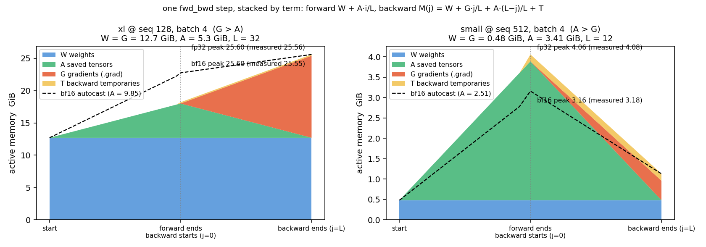

**图 2.2-1** 一步 fwd_bwd 的显存：色带是按 M(j) 公式画的（W/G/A/T 取实测值，🟦W / 🟩A / 🟥G / 🟨T 堆叠，fp32），虚线是 bf16 autocast 的公式曲线；× 是 hook 在每层前向 / 反向结束时读到的 `memory_allocated()` 实测点，压在公式曲线上

回到作业问的 xl。用 `torch.cuda.memory._record_memory_history` 记一步的分配历史（可拖进 pytorch.org/memory_viz），xl，batch 4。

**表 2.2-2** xl 各模式峰值显存，fp32 vs bf16 autocast（GiB；OOM 行为炸掉前水位，受碎片影响 ±1 GiB；bf16 列见 §2.3(e)）

| seq | 模式 | fp32 (GiB) | bf16 autocast (GiB) |
|----:|:--|:--|:--|
| 128  | forward（no_grad） | 12.90 | 19.18 |
| 128  | fwd_bwd | 25.56 | 25.55 |
| 128  | full | OOM @ optimizer（≈ 28–29） | OOM @ optimizer（≈ 28–29） |
| 2048 | forward（no_grad） | 21.38 | 25.27 |
| 2048 | fwd_bwd / full | OOM @ forward（25.96） | OOM @ forward（26.78） |

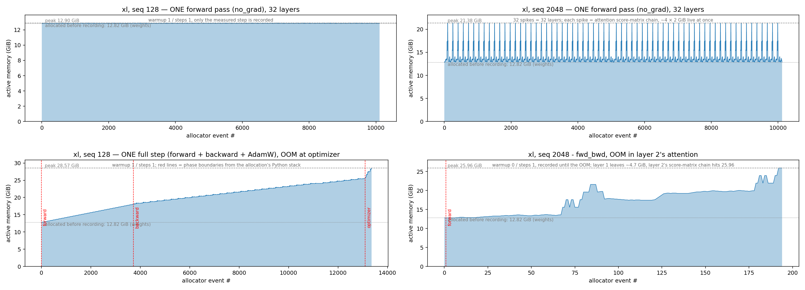

**图 2.2-2** xl 的显存快照时间线，每个点是一次真实分配 / 释放，四个面板各回答一件事：
左上 **seq 128 纯前向**——不为反向留东西，所以是平的；右上 **seq 2048 纯前向**——同样不留东西，但每层 attention 的 2 GiB 分数矩阵链让它有 32 根尖峰；左下 **seq 128 full step**——(a) 问的三个阶段，红线是分界；右下 **seq 2048 fwd_bwd 记录到 OOM**——(b) 问的"为什么 2048 过不了前向"。

- **(a) 从时间线上能认出 forward / backward / optimizer 三个阶段吗，各是什么形状？** 能，看左下，靠**斜率**认：前向 32 级上坡（每层留 🟩 166 MiB，12.8 → 18.1）；反向继续爬到 25.5（每层 −🟩 166 + 🟥 410）；optimizer 垂直冲到 ~28.6 OOM（Adam 的 m、v，= 2🟦W，M(j) 之外）。前两段的形状和图 2.2-1 左的模型一致。
- **(b) xl 在 seq 128 / 2048 下，forward / fwd_bwd / full 的峰值各多少？** 数字在表 2.2-2。两个 OOM 的原因：full 任何 seq 都装不下，左下 optimizer 那一段就是 2W 的 Adam 状态；seq 2048 连 fwd_bwd 都过不了前向，看右下——第 1 层 attention 链冲到 21.6，算完回落到 17.5（这一层留下了 ~4.7 GiB saved tensors），第 2 层的链再往上爬，25.96 撞墙。对比右上：纯前向每层用完就回到 12.8 基线，所以 32 层都过得去；带图前向每层往基线上加 4.7 GiB，第 2 层就没有 8 GiB 给尖峰了。第二篇 FlashAttention 消的就是这根尖峰。

#### (c)(d)(e) 逐 op：一层里谁最大、谁留到反向

照 §2.1 的办法，把 xl 一层 block 前向按子模块逐 op 列出每个 op 分配的输出（batch 4，32 头，d_head 80；大小 = shape × 4 B，与时间线上的 malloc 一致）：

**表 2.2-3** xl 一层 block 前向逐 op 分配的张量（seq 2048 vs 128）

| 子模块 | op | 分配的张量 | seq 2048 | seq 128 | 归到 |
|:--|:--|:--|--:|--:|:--|
| RMSNorm ×2 | `x²` 均值、rsqrt、`x·r`、`w⊙x̂` | `[b, s, d]` = `[4, s, 2560]` | 80 MiB × 2 | 5 MiB × 2 | 🟩 A（x̂ 反向要用） |
| attention 投影 | `Q = x·Wqᵀ`、K、V、RoPE(Q)、RoPE(K) | `[4, s, 2560]` | 80 MiB × 5 | 5 MiB × 5 | 🟩 A（RoPE 后的 Q、K 和 V） |
| **attention 核心** | `S = QKᵀ`（einsum） | `[b, h, s, s]` = `[4, 32, s, s]` | **2 GiB** | 8 MiB | 🟩 A（S） |
| | `S / √d` | 同上 | **2 GiB** | 8 MiB | 🟨 T（前向临时，即释放） |
| | `masked_fill(−inf)` | 同上 | **2 GiB** | 8 MiB | 🟨 T |
| | softmax：`x − max`、`exp`、`/ sum` | 同上 × 3 | **2 GiB × 3** | 8 MiB × 3 | 前两份 🟨 T；`/ sum` 的输出 P → 🟩 A |
| | `O = PV`、`O·Woᵀ` | `[4, s, 2560]` | 80 MiB × 2 | 5 MiB × 2 | 🟩 A（PV 输出是 Wo 的输入） |
| FFN | `w1(x)`、`w3(x)`、`SiLU`、门积 | `[b, s, d_ff]` = `[4, s, 10240]` | 320 MiB × 4 | 20 MiB × 4 | 🟩 A（w1(x)、w3(x)、silu·gate） |
| | `w2(·)` | `[4, s, 2560]` | 80 MiB | 5 MiB | 🟨 T |
| 残差加 ×2 | `x + …` | `[4, s, 2560]` | 80 MiB × 2 | 5 MiB × 2 | 加法不存；新的 x 由下一层 RMSNorm 存 → 🟩 A |

最后一列按 §3.1 的规则（局部导数里出现什么就存什么）判断，与 §3.2 实测的一层 saved tensors 清单一致。🟨 T 在 M(j) 里只算一层的量——图 2.2-2 右上那 32 根尖峰就是它在每层前向里的样子，seq 2048 时一层有 ~8 GiB，seq 128 时只有 32 MiB。

分配过的不都留下。xl@128 的 block5 前向一共 `cudaMalloc` 了 288 MiB，其中 **166 MiB、25 个张量**在前向结束时还活着——为反向保存的 saved tensors（58%）。按 malloc 时正在跑的 `aten::*` 算子归因（算子名读成「谁分配的」而非「张量属于谁」），前五个占 90%：

**表 2.2-4** xl@128 block5 留到反向的 166 MiB（= 🟩 A 的一层份额）按分配算子归因

| 来源算子 | saved tensors | 占比 | 是什么 |
|:--|--:|--:|:--|
| `aten::mul`     | 60 MiB | 36% | SwiGLU 的门积和 SiLU 的 `x·σ(x)`（`[4,128,10240]` 各 20 MiB） |
| `aten::bmm`     | 40 MiB | 24% | attention 的 q/k/v 与 `softmax·V` 输出 |
| `aten::empty`   | 20 MiB | 12% | FFN 线性层的输出本身（einsum 先 `empty` 再由 GEMM 写入） |
| `aten::sigmoid` | 20 MiB | 12% | SiLU 里的 `σ(x)` |
| `aten::add`     | 10 MiB |  6% | 残差加 |

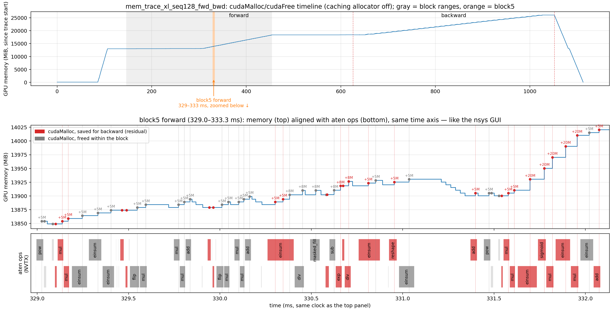

**图 2.2-3** xl@128 block5 前向的 cudaMalloc/cudaFree 与活到 range 结束的分配（红点）。采法：`PYTORCH_NO_CUDA_MEMORY_CACHING=1` + `nsys --cuda-memory-usage=true`（不关 caching allocator 只能看到显存池的增长），`--nvtx-ops` 打层 range、`emit_nvtx` 打算子 range；地址被复用，分配和释放按「之后的第一次 free」配对。脚本 `python -m benchmark.memory`。

- **(c) 残差流上一个 `[batch, seq, d_model]` 的 fp32 张量多大？** `[4, 2048, 2560] × 4 B` = **80 MiB**（seq 128 时 5 MiB），每 token 10 KiB。它是一层传给下一层的那个张量，拿它当尺子。
- **(d) 时间线上最大的分配是什么、多大、从哪行代码来？** 表 2.2-3 里 attention 核心那 6 份 **2 GiB**（尺子的 25 倍；调用栈 `model.py:253-257`、`nn_utils.py:15-24`），同一个 `[b, h, s, s]` 形状的链式中间量，即图 2.2-2 右上的尖峰；次大是 FFN 的 4 份 320 MiB。只有 attention 核心随 seq² 涨（2048 → 128 缩 256 倍），其余随 seq 线性（缩 16 倍）：seq 128 时最大的反而是 FFN 的 20 MiB，seq 一长 attention 才成主角——第二篇 FlashAttention 的动机。
- **(e) 一层 block 前向分配的显存里有多少要留到反向，反向又新分配多少？** 留到反向的是表 2.2-4 的 166 MiB，大头是 FFN 的 d_ff 宽中间量而不是 attention，和 (d) seq 128 的结论一致。反向这一段（用 `emit_nvtx` 的 `seq` 编号把 block5 的反向算子对回来）分配 1203 MiB、释放 954 MiB（含上面 161 MiB 的 saved tensors），净增 249 MiB；反向新产生 = 249 + 161 = **410 MiB** = 🟥 G 的一层份额（104.9M 参数的权重梯度 400 MiB）+ 🟨 T 里传给前一层的输入梯度 5 MiB（误差 1%）；分配了却又释放的其余 ~790 MiB 也是 🟨 T。这就是 (a) 里反向「不下坡」的原因。

**三张表怎么对**：表 2.2-3 是一层前向**先后**分配过的量（大部分即造即扔，不能加总），表 2.2-4 是其中**留到反向**的，表 2.2-2 是某一刻**同时活着**的峰值。用前两张凑后一张：

| 表 2.2-2 | 怎么凑 |
|:--|:--|
| 2048 forward（no_grad）21.38 | 🟦 W 12.8 + 🟨 T：attention 核心链上同时活着的 ~4 份 2 GiB（表 2.2-3）≈ 21.4 |
| 128 forward（no_grad）12.90 | 🟦 W 12.8 + 🟨 T 4 × 8 MiB + 零头 |
| 128 fwd_bwd 25.56 | 前向末尾 🟦 W + 🟩 A（32 × 166 MiB，表 2.2-4）= 18.1；G > A，反向末尾 🟦 W + 🟥 G = 25.4 才是峰值 |
| 2048 fwd_bwd OOM @ 25.96 | 🟦 W 12.8 + 🟩 A 已留下的层（每层 ~5.6 GiB：2 份 2 GiB 的 S/P + FFN 3 × 320 + 8 × 80）+ 🟨 T 当前层 8 GiB 的尖峰，第 2 层即撞墙 |

### 2.3 混合精度（Mixed Precision）

#### (a)(b)(c) 精度：谁该留在 fp32

**表 2.3-1** 1000 次 s += 0.01 在各 dtype 组合下的结果

| 累加 | 结果 |
|:--|--:|
| `s(fp32) += x(fp32)` | 10.0001 |
| `s(fp16) += x(fp16)` | 9.9531 |
| `s(fp32) += x(fp16)`（自动/手动升精度） | 10.0021 |
| `s(bf16) += x(bf16)` | **4.0000** |
| `s(fp32) += x(bf16)` | 10.0098 |

**(a) `s = 0; 重复 1000 次 s += 0.01`，累加器和加数分别用 fp32 / fp16 / bf16，结果各是多少，为什么？** 精度由**累加器**的 dtype 决定，加数是什么无所谓：fp16 累加器漂到 9.95；bf16 累加器只有 7 位尾数，到 4.0 就再也加不动——4.0 + 0.01 舍回 4.0；fp32 累加器无论加数是 fp16 / bf16 还是手动转过，都落在 10.00x（偏差来自 0.01 在 16 位里本身存不准，bf16 的表示误差是 fp16 的 8 倍，所以 10.0098 比 10.0021 偏得多）。

**表 2.3-2** `Linear → ReLU → LayerNorm → Linear` 玩具模型在 autocast(fp16) 下各张量的 dtype

| | 参数 | fc1 输出 | ln 输出 | logits | loss | 梯度 |
|:--|:--|:--|:--|:--|:--|:--|
| dtype | fp32 | fp16 | fp32 | fp16 | fp32 | fp32 |

**(b)(c) 参数 fp32 的玩具模型 `Linear → ReLU → LayerNorm → Linear` 包在 `torch.autocast(fp16)` 里训练，各张量是什么 dtype？为什么 LayerNorm 留在 fp32，换成 bf16 后还有必要吗？** autocast 不改存储的权重，只在算子调用时把输入转成 16 位：矩阵乘的输出（fc1、logits）是 fp16，LayerNorm、loss、梯度留在 fp32；bf16 下模式相同。LayerNorm 留 fp32 是因为它敏感的是特征维上的**归约**（均值 / 方差累加，正是 (a) 的场景）和方差里的**平方**（fp16 上限 65504 易溢出）。换 bf16 后溢出消失，但归约精度比 fp16 更差（表 2.3-1 里卡在 4.0 就是它），所以仍要留 fp32，理由从「怕溢出」变成「怕精度」；LayerNorm 只占前向 2–7%，留 fp32 基本免费。

#### (d)(e) 代价换来了什么：速度与显存

按 (b)，autocast 改的只有矩阵乘：时间上它走 Tensor core；显存上 🟩 A 里矩阵乘相关的 saved tensors 变 16 位（减），另存一份 bf16 权重副本（+参数量 × 2 B，也在 🟩 A 里，加）；🟦 W、🟥 G 始终 fp32 不动。按 §2.2 的判据，这两项只在峰值落于前向末尾（A > G）时进峰值；G > A 时峰值 = 2W，bf16 不改变峰值。

**表 2.3-3** bf16 autocast 的加速与峰值显存变化（batch 4 seq 512；A = 3.4 / 8.8 / 16.4 GiB ≫ G，峰值在前向末尾；后两列是 `saved_tensors_hooks` 按来源数出来的实测）

| Size | forward fp32 → bf16 (ms) | 加速 | backward fp32 → bf16 (ms) | 加速 | 峰值显存 fp32 → bf16 (GiB) | 其中权重侧 (GiB) | 其中 activation 侧 (GiB) |
|:-----|:--|--:|:--|--:|:--|--:|--:|
| small  |  17.2 →  9.2 | 1.87× |  33.9 →  20.1 | 1.69× | 4.08 → 3.18 (−21%) | +0.23 | −1.13 |
| medium |  50.1 → 24.4 | 2.05× | 102.3 →  57.3 | 1.79× | 10.58 → 8.36 (−21%) | +0.77 | −2.95 |
| large  | 114.8 → 49.9 | **2.30×** | 220.0 → 117.6 | 1.87× | 20.28 → 16.61 (−18%) | +1.78 | −5.50 |
| xl     | OOM → OOM | — | — | — | — | +6.35 | — |

- **(d) bf16 autocast 相对 fp32，各规格前向和反向快多少，显存省多少？** 前向快 1.9–2.3×、反向 1.7–1.9×，模型越大越快；反向低一些是因为梯度累加进 fp32 `.grad`。加速 = 位宽减半 × 换算术单元（fp32 矩阵乘只能走 CUDA core，bf16 进 Tensor core；关 `allow_tf32` 就是不让 fp32 偷偷进去）。显存省 18–21%：activation 侧没减半（small 3.41 → 2.28），因为 RMSNorm、残差流、loss 留在 fp32；权重侧多一份副本，模型越大越占上风。
- **(e) xl@128 / 2048 开 bf16 后峰值变化多少，为什么趋势不同？** 表 2.2-2 的 bf16 列：seq 128 no_grad 前向 +6.3（副本全在、没有 A 可省）；seq 128 fwd_bwd 持平（A 5.3 < G 12.7，峰值在反向末尾 = 2W，那时 A 和副本都已释放）；seq 2048 no_grad 前向 +3.9（副本 +6.35，🟨 T 尖峰从 8 GiB 缩到 4）。不是机制不同，是落在了 G > A 那一侧。推理时副本是 cast 缓存，可以关掉或干脆 `model.to(bf16)`；训练时它是反向 `dx = dy·W` 的输入，省不掉。

> **两份权重放哪里，决定了混合精度的用法**。同样是「一份 bf16 算、一份 fp32 更新」，两种布局：
>
> | | 模型里的参数 | 梯度 | optimizer 里 | B/param | 每步 | 适用 |
> |:--|:--|:--|:--|--:|:--|:--|
> | fp32 训练（参照） | fp32 4 | fp32 4 | m、v 8 | 16 | — | — |
> | **autocast**（本文） | fp32 4 + 临时 bf16 副本 2 | fp32 4 | m、v 8 | 18 | 前向 cast 出 bf16 副本，用完丢 | 单卡、一行代码开；副本进 🟩 A |
> | **Megatron / DeepSpeed** | **bf16 2（常驻）** | bf16 2（或累加进 fp32 main_grad 4） | **fp32 master 4** + m、v 8 | 16–18 | 用 fp32 master 更新，cast 回 bf16 参数 | 多卡：master + m + v 随 optimizer 分片（ZeRO-1），每卡只常驻 2 B/param 的权重 |
>
> 总量差不多，Megatron 布局省的是每步 cast 和分片后每卡的份额——单卡上没差别，多卡上是主流做法。

---

## 3 单卡显存（Single-GPU Memory）

### 3.1 autograd 为反向存了什么（Autograd Residuals）

**问题**：autograd 到底为反向存了哪些张量？先用最小的例子 RMSNorm 看清楚，再看 `torch.compile` 融合后有什么变化。

§2.2(e) 是按 malloc 归因的「粗账」。要看每个 op 到底为反向存了什么，用 `torch.autograd.graph.saved_tensors_hooks` 在 pack/unpack 时打印。以纯 fp32 的 RMSNorm 为例（`x: [4,512,2560]`）：

$\mathrm{RMSNorm}(x)_i = w_i \cdot \frac{x_i}{\sqrt{\frac{1}{d}\sum_{j=1}^{d} x_j^2 + \epsilon}}$，拆成 5 个 op：
$\underbrace{r = \big(\underbrace{\tfrac{1}{d}\textstyle\sum_j \underbrace{x_j^2}_{①}}_{②} + \epsilon\big)^{-1/2}}_{③}$，$\underbrace{\hat{x} = x \cdot r}_{④}$，$\underbrace{y = w \odot \hat{x}}_{⑤}$

```python
rms = torch.rsqrt(x.pow(2).mean(-1, keepdim=True) + eps)   # ① pow  ② mean  ③ rsqrt
x_hat = x * rms                                             # ④ mul
y = weight * x_hat                                          # ⑤ mul
```

`saved_tensors_hooks` 在 pack/unpack 时打印（完整输出 `assets/s3/rmsnorm_saved_tensors.txt`）：

```
Saving  1  [4,512,2560]  grad_fn=None            ptr=…9040
Saving  2  [4,512,1]     grad_fn=RsqrtBackward0  ptr=…6b00
Saving  3  [4,512,1]     grad_fn=RsqrtBackward0  ptr=…6b00
Saving  4  [4,512,2560]  grad_fn=None            ptr=…9040
Saving  5  [4,512,2560]  grad_fn=MulBackward0    ptr=…3c00
Saving  6  [2560]        grad_fn=None            ptr=…1000
Loading    5 → 6 → 2 → 4 → 3 → 1
```

规则只有一条：每个算子的局部偏导里出现了哪个变量，前向就得把它存下来；偏导是常数的什么都不存。「存」是让反向节点持有引用，不是拷贝，所以本来就活着的输入 `x` 和参数 `w` 不占额外显存。

**表 3.1-1** RMSNorm 五个 op 各自为反向存的张量（eager）

| op | 前向 | 反向要算的偏导 | 偏导里出现的变量 → 存它 | shape | `grad_fn` | 额外显存 | print 里第几条 |
|:--|:--|:--|:--|:--|:--|--:|:--|
| ① | $x^2$ | $\partial x^2/\partial x = 2x$ | $x$ | `[4,512,2560]` | None（叶子） | 0（输入本来就在） | 1 |
| ② | $v=\tfrac1d\sum x^2$ | $\partial v/\partial x^2 = \tfrac1d$ | 常数，不存 | — | — | 0 | — |
| ③ | $r=(v+\epsilon)^{-1/2}$ | $\partial r/\partial v = -\tfrac12 r^3$ | $r$ | `[4,512,1]` | RsqrtBackward | **8 KiB** | 3 |
| ④ | $\hat{x}=x\cdot r$ | $\partial\hat{x}/\partial x = r$ | $r$ | `[4,512,1]` | RsqrtBackward | 0（同上一块） | 2 |
| | | $\partial\hat{x}/\partial r = x$ | $x$ | `[4,512,2560]` | None（叶子） | 0（同第 1 条） | 4 |
| ⑤ | $y=w\odot\hat{x}$ | $\partial y/\partial w = \hat{x}$ | $\hat{x}$ | `[4,512,2560]` | MulBackward | **20 MiB** | 5 |
| | | $\partial y/\partial\hat{x} = w$ | $w$ | `[2560]` | None（叶子） | 0（参数本来就在） | 6 |

6 次 Saving 只对应 4 块内存：ptr 显示第 1/4 条同址（x）、第 2/3 条同址（r）。真正为反向多留的只有 $r$ 和 $\hat{x}$，即一份输入大小。

画成图：灰色是算子，实线是前向；`x` 是上一层传来的 activation，`w` 是本层参数；`r`、`x̂` 是前向新产生的 tensor，用细线连到 pack 它的算子。虚线是反向，标的是这一步 unpack 的 tensor，颜色与 tensor 一致。

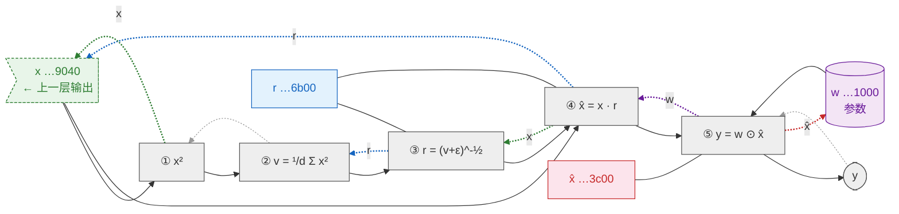

反向沿虚线 ⑤ → ④ → ③ → ② → ①：⑤ 取 $\hat{x}$、$w$，④ 取 $r$、$x$，③ 取 $r$，① 取 $x$，与 print 的 Loading 顺序一致。`x` 有两条虚线入边，两路梯度在叶子上累加。

#### 算子融合（Operator Fusion）

回看表格：$\partial\hat{x}/\partial x$ 只用到 $r$ 和 $\hat{x}$，而 $\hat{x}=x\cdot r$ 是一次逐元素乘——反向手里有 $x$ 和 $r$ 就能当场算回 $\hat{x}$，不必存那 20 MiB。逐算子写法做不到，因为 ⑤ 的 MulBackward 只知道「我要 $\hat{x}$」，不知道它是 $x\cdot r$ 来的。`torch.compile(RMSNorm(...))` 把 ①–⑤ 追踪成一张图，AOTAutograd 生成一个前向 kernel、一个反向 kernel，并在「存」和「重算」之间选便宜的：

```
Saving  1  [4,512,2560]  grad_fn=None  ptr=…3c80   # x
Saving  2  [2560]        grad_fn=None  ptr=…b3c0   # w
Saving  3  [4,512,1]     grad_fn=None  ptr=…f9c0   # r
Loading    1 → 2 → 3（与 Saving 同序）
```

整个 RMSNorm 成了一个算子，反向公式由 AOTAutograd 写死：

**表 3.1-2** torch.compile 融合后 RMSNorm 为反向存的张量

| op | 前向 | 反向要算的偏导 | 偏导里出现的变量 → 存它 | shape | `grad_fn` | 额外显存 | print 里第几条 |
|:--|:--|:--|:--|:--|:--|--:|:--|
| fused | $y = w\odot\big(x\cdot r\big)$，$r=(\tfrac1d\sum x^2+\epsilon)^{-1/2}$ | $\partial y/\partial w = \hat{x}$ | $\hat{x}$ → **不存**，反向用 $x\cdot r$ 重算 | — | — | 0 | — |
| | | $\partial y/\partial x = r\,w\odot(I-\tfrac1d\hat{x}\hat{x}^{\!\top})$ | $x$ | `[4,512,2560]` | None（叶子） | 0（输入本来就在） | 1 |
| | | | $w$ | `[2560]` | None（叶子） | 0（参数本来就在） | 2 |
| | | | $r$ | `[4,512,1]` | None（节点内部量） | **8 KiB** | 3 |

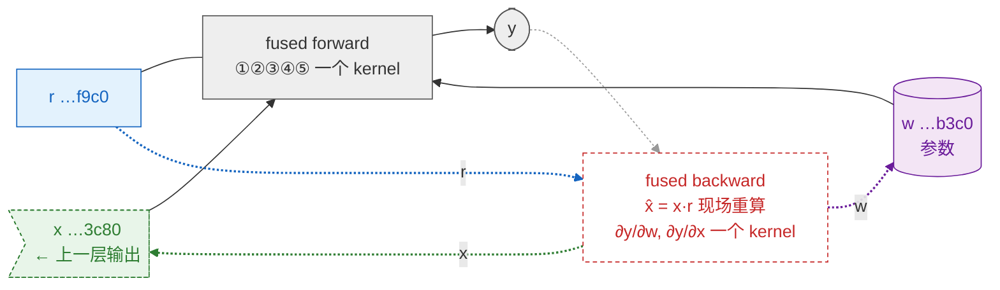

额外显存从 $r+\hat{x}$ ≈ 20 MiB 降到 $r$ ≈ 8 KiB，代价是反向多一次 $x\cdot r$。

原始输出见 `assets/s3/rmsnorm_saved_tensors.txt`。

### 3.2 激活检查点（Activation Checkpointing）

**问题**：融合之后一层 Transformer block 还要为反向存多少；`torch.utils.checkpoint` 怎么用时间换显存。作业题 `gradient_checkpointing`：(a) 忽略算力，峰值显存最小的 checkpoint 策略是什么，渐近显存和计算各多少；(b) 只允许重算一次（不嵌套），xl@2048 batch 4 最优的段长是多少，实测验证并比较相邻段长。

xl 一层 TransformerBlock 用 `torch.compile(fullgraph=True)` 融到极限，为反向存的仍有 **3655 MiB**（作业文档给的参考值 3651，多 4 MiB 是我们的实现显式传入的 mask）。剩下的全是矩阵乘的输入，融合动不了：

**表 3.2-1** xl 一层 block（compile 后）为反向存的 3655 MiB 构成

| 大小 (MiB) | 张量 | 占比 |
|--:|:--|--:|
| 1024 ×2 | attention 的 S=QKᵀ、P=softmax(S)，`[b,h,s,s]` | 56% |
| 320 ×3 | FFN 的 `w1(x)`、`w3(x)`、`silu·gate`，`[b,s,d_ff]` | 26% |
| 80 ×8 | `[b,s,d]` 级：x、ln1(x)、ln2(x)、Q、K、V、attn 输出、x 转置 | 17% |
| ~7 | mask、RoPE cos/sin、softmax 统计量、rms | 0.2% |

> shape 和总量是 `saved_tensors_hooks` 实测，MiB 按 shape × 4 B 算，「是什么」按 shape 唯一性反推。

32 层 = 114 GiB，xl@2048 fp32 光 saved tensors 就装不下。attention 那 2 GiB 靠 §4 FlashAttention，其余靠 checkpointing。

checkpointing 是用计算换显存。x 轴：反向峰值时活着的 saved tensors；y 轴：一步要算几遍前向（xl@2048 batch 4，L = 32）：

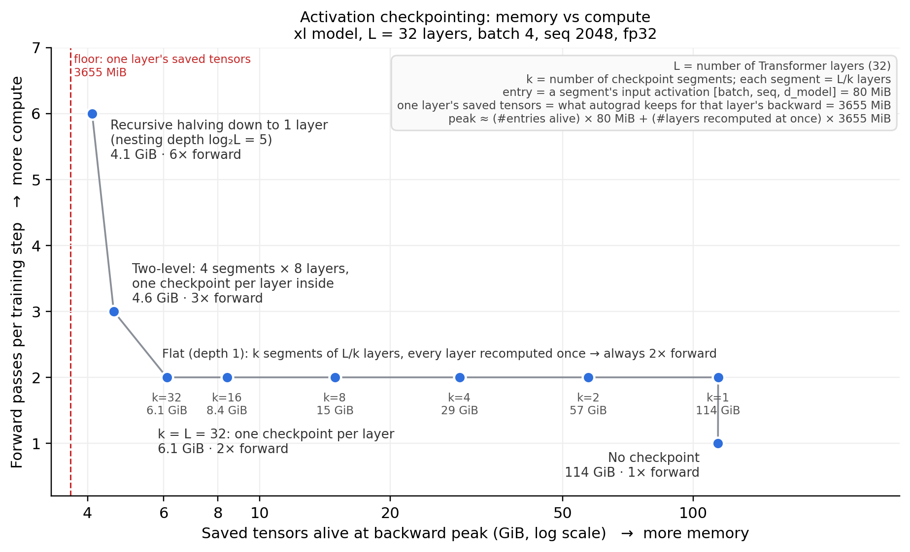

**图 3.2-1** checkpoint 策略的显存–计算权衡（xl@2048 batch 4，L = 32）

- **y = 2× 那一排**：平切成 k 段。每层恰好被重算一次，所以总前向恒为 2×；k 只决定同时物化几层，从 k = 1（114 GiB）到 k = L（6.1 GiB）单调下降——entry 太便宜，没有 U 形。(b) 问的就是这一排。
- **往左上**：嵌套 checkpoint。一层的 saved tensors（3.6 GiB，红虚线）是底线，减的只是 entry，计算从 2× 涨到 6×。(a) 的答案在左上角。
- 实践停在 k = L，或者用选择性重算（只丢 S、P 这类大而便宜的张量，前向 +5%）。要压底线本身靠 §4 FlashAttention。

#### 重算（Recomputation）

`checkpoint(fn, x)` 是**推迟**不是压缩：前向只留 `fn` 的输入（entry），反向到这段时重跑一遍前向造出 saved tensors，用完释放。4 层 xl block 实测：

**表 3.2-2** 4 层 block 有无 checkpoint 的峰值构成（MiB）

| | ① 前向留下、活到反向（实测） | ② 反向重算一段临时物化（估） | 峰值 ① + ② |
|:--|--:|--:|--:|
| 不 checkpoint | 4 × 3655 = **14621 MiB** | 0 | 14.6 GiB |
| 每 2 层一个 checkpoint | 2 个 entry × 80 = **160 MiB** | 2 × 3655 = 7310 MiB | 7.5 GiB |

k 段的峰值 ≈ k × 80 MiB + (L/k) × 3655 MiB。代价：每层前向算两遍，一步 ≈ 2 fwd + bwd，多约 1/3。

画法同 §3.1：实线前向、红虚线反向，挂在算子下的框是它为反向留的东西。**绿 = 前向留下、一直占着；红 = 前向丢掉、反向时重算、用完释放。**

**不 checkpoint**：每层各自留 3655 MiB（含输入 x_i），一起活到反向。

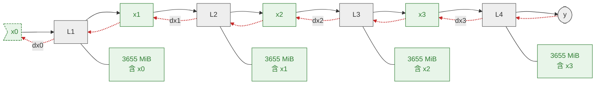

**每 2 层一个 checkpoint**：只留 entry x0、x2；x1、x3 和两层的 saved tensors 都在框内，反向到这段时重算。

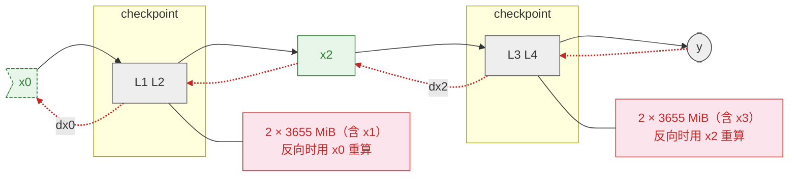

两段不能并行：L2 反向要 `dx2`，它是 L3 反向的输出。前半段的重算只依赖 x0、理论上能提前，但那样两段的红色同时活着，峰值回到 14.6 GiB。

#### (a) 递归检查点（Recursive Checkpointing）：忽略算力时的最优策略

峰值 = 一层的 saved tensors + 活着的 entry。前者最少 1 层，每层一个 checkpoint 已做到；后者要存 x0…x_{L-1}，O(L)。**entry 也是 activation，也能被 checkpoint 掉**：一段层外面再包一层 `checkpoint`，段内的 entry 就不存，反向到这段时重算。一路对半包到底就是一棵二叉树——节点 = 一次 `checkpoint` 调用、留自己的 entry；叶子 = 层：

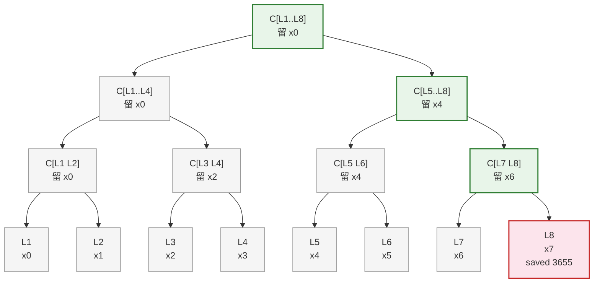

反向到 L8 时活着的只有根到它**这条路径**上的：4 个 entry（x0 x4 x6 x7，各属于一个开始了还没做完的 checkpoint）+ L8 的 saved tensors。路径外的灰节点此刻不占显存。同一时刻用上一节的画法，颜色 = entry 是第几层重算时出现的：

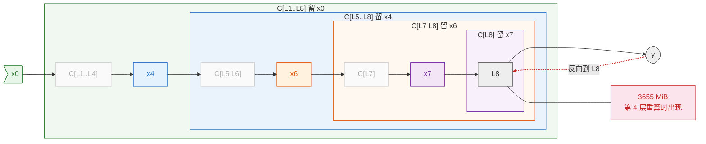

完整顺序（F = 重算前向，B = 反向）。autograd 走到 checkpoint 节点先重跑它的前向再往里走，碰到普通层才 backward。后两列是此刻活着的 saved tensors：entry（80 MiB 一个）和某一层内部的（3655 MiB）：

**表 3.2-3** 8 层递归 checkpoint 的 F/B 执行轨迹

| 步 | F / B | 做什么（括号 = 前向了几层） | entry x_i：用 → 得 ⇒ 显存里留着的 | one layer's saved tensors（MiB） |
|--:|:--|:--|:--|--:|
| 0 | F | 原始前向 L1–L8（8） | x0 → y ⇒ {x0} | 0 |
| 1 | F | 重算 C[L1..L8]（8） | x0 → x4 ⇒ {x0 x4} | 0 |
| 2 | F | 重算 C[L5..L8]（4） | x4 → x6 ⇒ {x0 x4 x6} | 0 |
| 3 | F | 重算 C[L7 L8]（2） | x6 → x7 ⇒ {x0 x4 x6 x7} | 0 |
| 4 | F | 重算 C[L8]（1） | x7 → L8 saved tensors ⇒ {x0 x4 x6 x7} | **3655**（峰值，上图） |
| | B | 反向 L8 | → dx7 ⇒ {x0 x4 x6 x7} | 0 |
| 5 | F | 重算 C[L7]（1） | x6 → L7 saved tensors ⇒ {x0 x4 x6 x7} | 3655 |
| | B | 反向 L7；C[L7 L8] 完成 | → dx6，−x7 −x6 ⇒ {x0 x4} | 0 |
| 6–8 | F/B | 同样做完 L6、L5：C[L5 L6]（2）→ C[L6]（1）→ C[L5]（1）；C[L5..L8] 完成 | x4 → x5 → … ⇒ 最多 {x0 x4 x5}，最后 −x5 −x4 ⇒ {x0} | ≤ 3655 |
| 9–15 | F/B | 左半边同理：C[L1..L4]（4）→ C[L3 L4]（2）→ C[L4]（1）→ C[L3]（1）→ C[L1 L2]（2）→ C[L2]（1）→ C[L1]（1） | x0 → x2 → x3 → … ⇒ 最多 {x0 x2 x3} | ≤ 3655 |

树高 log₂L：任一时刻 entry ≤ log₂L + 1 个、层内 saved tensors 1 层，峰值 **O(log L)**。计算：树的每个深度上所有节点重算一遍加起来正好是整网一遍（8 = 4+4 = 2+2+2+2 = 1×8），log₂L + 1 个深度再加原始前向，共 L × (log₂L + 2)——8 层是 40，**O(L log L)**。对比：不 checkpoint L，平切 2L。

```python
def ckpt(layers, x):
    if len(layers) == 1:
        return layers[0](x)                          # 叶子：普通前向，saved tensors 会留
    mid = len(layers) // 2
    left  = lambda x: ckpt(layers[:mid], x)
    right = lambda x: ckpt(layers[mid:], x)
    return checkpoint(right, checkpoint(left, x))    # 两个子树各包一个 checkpoint
```

#### (b) 只允许重算一次：最优段长

不嵌套只能平切 k 段，峰值 = k × entry + (L/k) × 一层 saved tensors。xl@2048 是 k × 80 + (32/k) × 3655 MiB，两项相等要 k ≈ 38 > 32——entry 比一层 saved tensors 小 45 倍，所以切到最细（每层一个）最优，没有中间的平衡点。

(b) 指定的 xl@2048 batch 4 在 5090 上量不了：参数+梯度 25.4 GiB，任何段长都 OOM。用 large（36 层，参数+梯度 7.2 GiB）测：batch 4 / seq 2048 只有每段 ≤ 4 层能跑（15.4 / 18.9 / 22.5 / 26.1 GiB，每多 1 层 +3.6 GiB），要让全部段长含「不 checkpoint」都出数，降到 batch 1 / seq 1024，fwd_bwd：

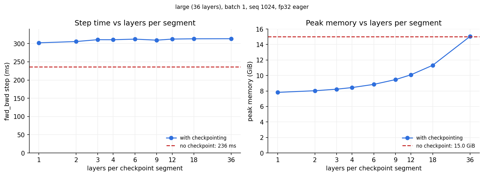

**图 3.2-2** checkpoint 段长扫描（large，batch 1 seq 1024）

**表 3.2-4** checkpoint 段长扫描：峰值显存与 step 时间（large，batch 1 seq 1024，fwd_bwd）

| 每段几层 | 1 | 2 | 3 | 4 | 6 | 9 | 12 | 18 | 36（整网一段） | 不 checkpoint |
|:--|--:|--:|--:|--:|--:|--:|--:|--:|--:|--:|
| 反向时同时物化的层数 | 1 | 2 | 3 | 4 | 6 | 9 | 12 | 18 | 36 | 36（前向就存着） |
| 反向时重算的前向（层） | 36 | 36 | 36 | 36 | 36 | 36 | 36 | 36 | 36 | **0** |
| 峰值显存 (GiB) | **7.8** | 8.0 | 8.2 | 8.4 | 8.9 | 9.5 | 10.1 | 11.3 | 15.0 | 15.0 |
| step (ms) | 302 | 306 | 311 | 311 | 312 | 309 | 312 | 313 | 313 | **236** |

两行标注说明了两条曲线：显存跟「同时物化几层」走，时间跟「重算多少层」走。重算总量不管怎么切都是整网 36 层（每段各重跑一次，加起来一遍），所以时间恒为 4F ≈ 313 ms；不 checkpoint 不重算，3F = 236 ms（§2.1 的反向 ≈ 2× 前向）。整网一段（36）是纯亏：重算了一遍，显存却和不 checkpoint 一样。

显存随每段层数单调上升、无 U 形，**每层一个 checkpoint 最优**（7.8 GiB，比不 checkpoint 省 7.2 = 36 × 0.2 GiB，即全部 saved tensors 只剩 1 层）；相邻档每段 2 层差 0.2 GiB，比 1 更细不存在；整网一段（36）和不 checkpoint 一样大，因为反向时整网重算。step 时间 302–313 ms 与段长无关，比不 checkpoint 的 236 ms 多 28–33%——正是"平切恒为 2× 前向、前向占一步约 1/3"。

L 层、每段 e 层、entry 大小 a、一层 saved tensors 大小 r，峰值 = 全部 L/e 个 entry + 正在重算的 e 层：

$M(e) = \frac{L}{e}a + e\,r$

e 越小第二项越小，但 entry 数 L/e 越多。只要 **全部 entry 加起来都不到一层 saved（L·a < r）**，第一项永远压不过第二项，显存随 e 单调、最优 e = 1。这里 36 × 5 MiB = 180 MiB < 220 MiB；xl@2048 是 32 × 80 = 2.5 GiB < 3.6 GiB。Transformer 每层很胖，几乎总是如此；只有层数超过 r/a（这里 ≈ 44）时 e = 1 才会比 e = 2 更费。

**怎么选**：段长永远是 1，真正的旋钮是「包几层」。计算代价 ∝ 包的层数 N，显存节省 ∝ N × 单层 saved，线性可调——按显存缺口取最小的 N，不必全包。顺序：不 checkpoint → FlashAttention / 选择性重算（几乎免费）→ 包 N 层（e = 1）→ 全包（2× 前向）。Megatron 的 `--recompute-method block --recompute-num-layers N` 就是第三步。

> 原始输出 `assets/s3/checkpoint_large_b1_seq1024.md`（含逐步耗时）、`checkpoint_large_b4_seq2048.md`。eager 模式，一层 saved tensors 比 §3.2 开头 compile 后的账多出 RMSNorm、SiLU 的中间量。

> 原始输出 `assets/s3/four_blocks_checkpoint.txt`，实验在 `notes/notes.ipynb` §3.2。
